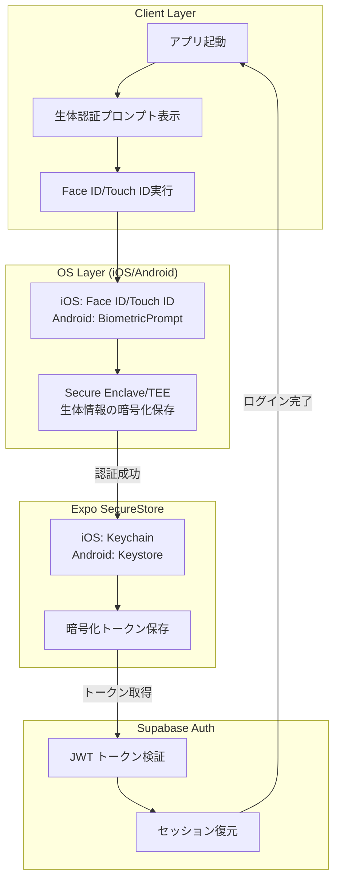
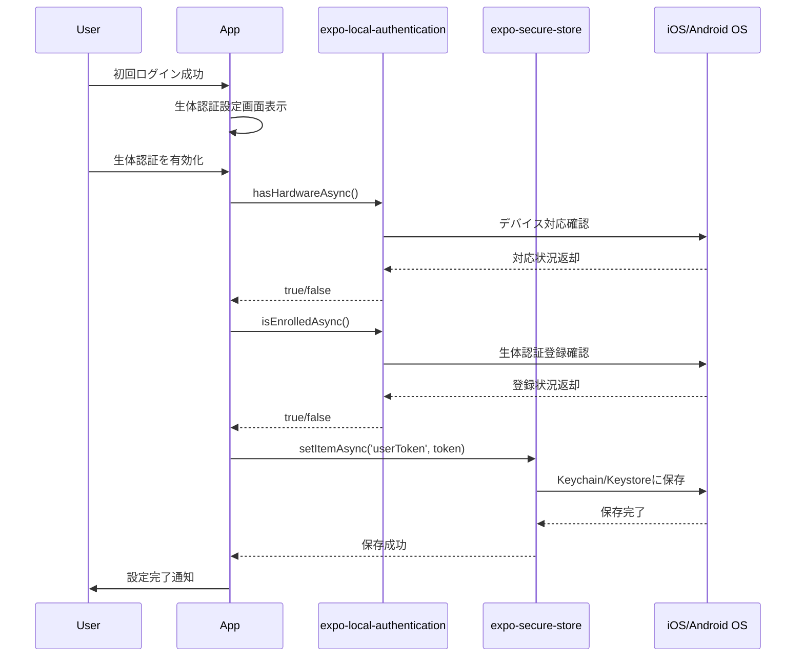
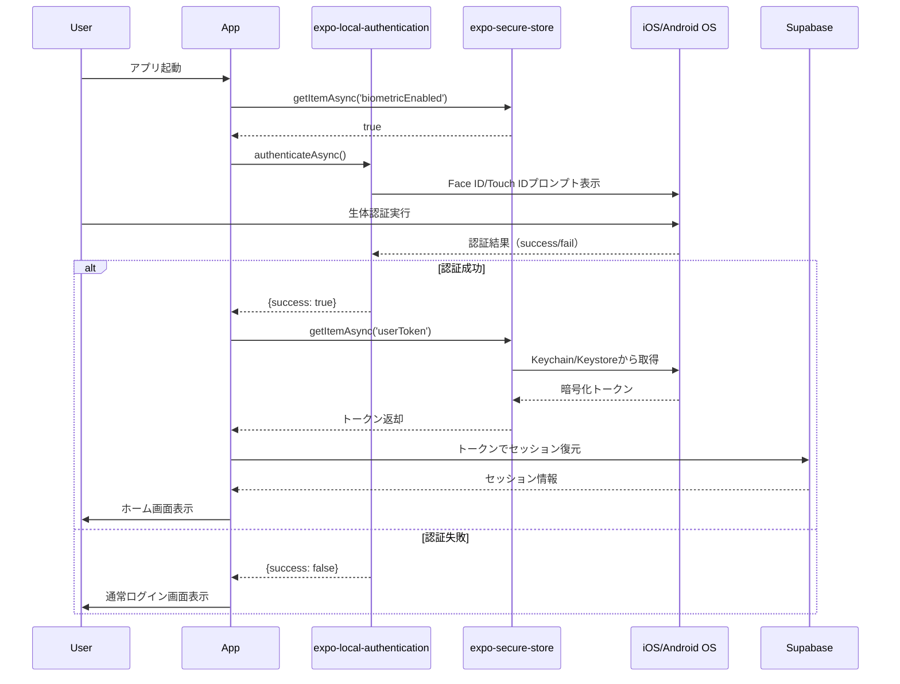

# アーキテクチャ設計書

## 技術仕様

### フロントエンド
- React Native
- Expo

### バックエンド・データベース
- Supabase

### プラットフォーム
- iOS/Android対応のスマートフォンアプリ

## 技術スタック
- **フロントエンド**: React Native + Expo
- **バックエンド**: Supabase Edge Functions (Deno)
- **データベース**: Supabase PostgreSQL + RLS
- **認証**: Supabase Auth (JWT) + 生体認証（Face ID/Touch ID）
- **セキュアストレージ**: Expo SecureStore（Keychain/Keystore）
- **リアルタイム通信**: Supabase Realtime
- **ストレージ**: 不要
- **通知・音響**: 不要
- **ナビゲーション**: 不要
- **状態管理**: React Context（UnreadContext、AuthContext）
- **インフラ**: Supabase + Google Cloud Storage + Cloud CDN

## システム構成図
マーメイド図をここに記載


## 選択理由

- **React Native + Expo**: 個人開発に最適。一つのコードベースでiOS/Android対応、豊富なライブラリとExpoの簡単なビルド・デプロイ機能
- **Supabase**: Firebase代替のオープンソースBaaS。PostgreSQL、認証、リアルタイム、ストレージを統合提供。個人開発者に優しい料金体系
- **Supabase Edge Functions**: Deno Runtime上でのサーバーレス関数。TypeScriptネイティブサポート。セキュアなAPI実装が可能
- **Supabase PostgreSQL**: 高機能なリレーショナルDB。Row Level Security（RLS）でセキュアなマルチテナント設計が可能
- **Supabase Auth**: JWT認証、OAuth対応、メール認証など必要な認証機能を簡単に実装。追加コストなし
- **Supabase Realtime**: PostgreSQLの変更をリアルタイムでクライアントに通知。WebSocketベースでリアルタイムチャット機能を実現
- **Supabase Storage**: ファイル保存・配信。RLSによるセキュアなファイルアクセス制御
- **Google Cloud Storage + Cloud CDN**: 画像・動画の大容量ストレージとCDN配信。従量課金で小規模時は低コスト
- **Vision API**: 画像の自動審査（不適切コンテンツ検出、SafeSearch）。人手での審査コストを大幅削減。高精度な日本語対応
- **Expo Haptics + Audio**: ネイティブな触覚フィードバックと音響効果。UX向上に貢献

## 初期コスト（Initial）
- **Apple Developer Program**: $99
- **Google Play Developer**: $25
- **ドメイン取得**: $15
- **SSL証明書**: $0 (Let's Encrypt)
- **開発ツール**: $0 (オープンソース)
- **合計**: $139

## ランニングコスト
- **Supabase Pro**: $25/月
- **Google Cloud Storage**: $3/月 (50GB想定)
- **Cloud CDN**: $2/月
- **Vision API**: $8/月 (1000画像/月想定)
- **ドメイン**: $1/月
- **合計**: $39/月 ($468/年)


## アーキテクチャの特徴

### 🎯 個人開発最適化
- **ワンストップ開発**: Supabaseで認証・DB・API・リアルタイムを統合管理
- **ノーコード/ローコード**: 管理画面、分析ダッシュボードが標準装備
- **簡単デプロイ**: Expo EAS Buildで自動ビルド・ストア申請

### 💰 コスト効率
- **従量課金**: 利用量に応じた料金体系で初期は低コスト
- **無料枠活用**: 多くのサービスで無料枠を最大限活用
- **運用自動化**: 手動運用を最小限に抑制

### 🔒 セキュリティ
- **RLS（Row Level Security）**: データベースレベルでのアクセス制御
- **JWT認証**: ステートレスで安全な認証システム
- **HTTPS/WSS**: 全通信の暗号化

### 📈 スケーラビリティ
- **段階的成長**: ユーザー数に応じてプラン変更で対応
- **マネージドサービス**: インフラ管理の負担を最小化
- **マイクロサービス化**: 必要に応じて機能を分離可能

## 生体認証アーキテクチャ

> **注意**: この機能は実装済みですが、Apple Developer Accountが必要なため、実機でのテストは後回しとしています。Expo Goでは動作しないため、EAS BuildまたはDevelopment Buildが必要です。

### 概要
Face ID/Touch ID/指紋認証などのデバイス生体認証機能を活用した、簡単かつセキュアなログイン機能。

### 技術スタック
- **生体認証API**: `expo-local-authentication`
- **セキュアストレージ**: `expo-secure-store`
- **プラットフォーム**: iOS Keychain / Android Keystore

### 実装ステータス
- ✅ コード実装完了
- ⏳ 実機テスト保留中（Apple Developer Account取得後に実施）
- ⏳ Development Build / EAS Build必要

### アーキテクチャ図



### データフロー

#### 初回設定フロー


#### ログインフロー


### セキュリティ設計

#### トークン管理
**保存場所**:
- **iOS**: Keychain（暗号化された安全な領域）
- **Android**: Keystore（ハードウェアベースの暗号化）

**保存内容**:
```typescript
{
  userToken: string,           // Supabase JWTトークン
  refreshToken: string,        // リフレッシュトークン
  biometricEnabled: boolean,   // 生体認証有効フラグ
  tokenExpiry: number,         // トークン有効期限（UnixTime）
  deviceId: string            // デバイス識別子
}
```

#### セキュリティ要件

**1. トークン暗号化**
- Expo SecureStoreによる自動暗号化
- アプリごとに独立したストレージ領域
- アプリアンインストール時に自動削除

**2. タイムアウト管理**
```typescript
const TOKEN_EXPIRY_DAYS = 30; // 30日間有効
const isTokenValid = (expiry: number) => {
  return Date.now() < expiry;
};
```

**3. デバイス変更検出**
```typescript
import * as Device from 'expo-device';

const currentDeviceId = Device.osBuildId;
const savedDeviceId = await SecureStore.getItemAsync('deviceId');

if (currentDeviceId !== savedDeviceId) {
  // デバイス変更検出 → 再ログイン要求
  await clearBiometricData();
  redirectToLogin();
}
```

**4. 失敗ロックアウト**
- 生体認証失敗5回で一時ロックアウト（5分間）
- OSレベルの制限も併用（iOS: 5回失敗でパスコード入力必須）

#### フォールバック機構

**生体認証失敗時の対応**:
```typescript
const result = await LocalAuthentication.authenticateAsync({
  promptMessage: 'Face IDでログイン',
  fallbackLabel: 'パスワードを使用',
  disableDeviceFallback: false, // デバイスのフォールバック有効
});

if (!result.success) {
  // 通常ログイン画面へ遷移
  router.push('/auth/login');
}
```

### 実装仕様

#### 必要なライブラリ
```json
{
  "expo-local-authentication": "^14.0.0",
  "expo-secure-store": "^13.0.0",
  "expo-device": "^6.0.0"
}
```

#### 主要APIメソッド

**1. デバイス対応確認**
```typescript
const hasHardware = await LocalAuthentication.hasHardwareAsync();
const supportedTypes = await LocalAuthentication.supportedAuthenticationTypesAsync();
// 返却値: [1] = FINGERPRINT, [2] = FACIAL_RECOGNITION, [3] = IRIS
```

**2. 生体認証登録確認**
```typescript
const isEnrolled = await LocalAuthentication.isEnrolledAsync();
// true: デバイスに生体認証が登録済み
// false: 未登録（設定画面への誘導が必要）
```

**3. 生体認証実行**
```typescript
const result = await LocalAuthentication.authenticateAsync({
  promptMessage: 'ログインするにはFace IDで認証してください',
  fallbackLabel: 'パスワードを使用',
  cancelLabel: 'キャンセル',
  disableDeviceFallback: false,
});

// result.success: boolean（認証成功/失敗）
// result.error: string（エラーメッセージ）
```

**4. セキュアストレージ操作**
```typescript
// 保存
await SecureStore.setItemAsync('userToken', token, {
  keychainAccessible: SecureStore.WHEN_UNLOCKED,
});

// 取得
const token = await SecureStore.getItemAsync('userToken');

// 削除
await SecureStore.deleteItemAsync('userToken');
```

### エラーハンドリング

#### エラーケースと対応

| エラーケース | 検出方法 | 対応 |
|------------|---------|-----|
| デバイス非対応 | `hasHardwareAsync() === false` | 生体認証機能を非表示 |
| 生体認証未登録 | `isEnrolledAsync() === false` | デバイス設定画面への誘導 |
| 認証失敗 | `result.success === false` | 通常ログイン画面へ |
| トークン期限切れ | `Date.now() > tokenExpiry` | 再ログイン要求 |
| デバイス変更 | `deviceId !== savedDeviceId` | セキュリティ警告 + 再ログイン |
| ストレージエラー | `SecureStore throws error` | 通常ログインへフォールバック |

### パフォーマンス考慮事項

**1. 起動時の最適化**
```typescript
// 並列処理で高速化
const [hasHardware, isEnrolled, savedToken] = await Promise.all([
  LocalAuthentication.hasHardwareAsync(),
  LocalAuthentication.isEnrolledAsync(),
  SecureStore.getItemAsync('userToken'),
]);
```

**2. キャッシュ戦略**
- 生体認証対応状況をアプリ起動時に1回だけ確認
- デバイス情報は初回のみ取得してキャッシュ

**3. ユーザー体験**
- 認証プロンプトは500ms以内に表示
- タイムアウトは30秒に設定
- 失敗時は即座にフォールバック画面を表示

### プライバシー設計

**生体情報の取り扱い**:
- アプリは生体情報（顔データ、指紋データ）に一切アクセスしない
- OSが提供する認証結果（成功/失敗）のみを受け取る
- 生体情報はデバイス内のSecure Enclave/TEEに暗号化保存
- サーバーへの送信は一切なし

**ユーザー同意**:
- 初回設定時に生体認証の仕組みを説明
- オプトイン方式（ユーザーが明示的に有効化）
- いつでも設定から無効化可能

