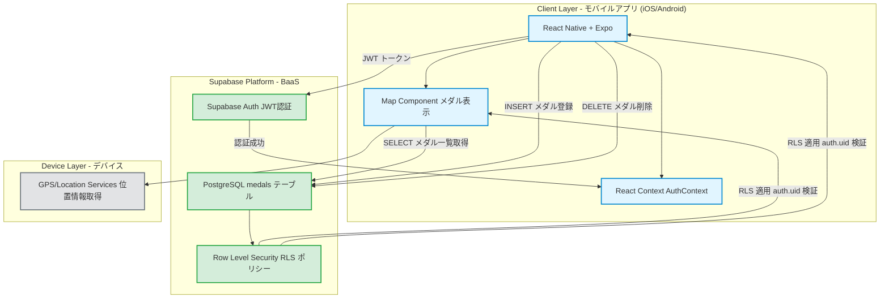

# アーキテクチャ設計書

## 技術仕様

### フロントエンド
- React Native
- Expo

### バックエンド・データベース
- Supabase

### プラットフォーム
- iOS/Android対応のスマートフォンアプリ

## 技術スタック
- **フロントエンド**: React Native + Expo
- **データベース**: Supabase PostgreSQL + RLS
- **認証**: Supabase Auth (JWT)
- **ストレージ**: 不要
- **通知・音響**: 不要
- **ナビゲーション**: 不要
- **状態管理**: React Context（AuthContext）
- **インフラ**: Supabase

## システム構成図

### システム構成図の説明

**Client Layer (クライアント層)**
- React Native + Expoでクロスプラットフォーム開発
- React Contextで認証状態を管理

**Supabase Platform (バックエンド)**
- JWT認証による安全な認証システム
- PostgreSQLで構造化データ管理
- Row Level Securityでデータアクセス制御

**Device Layer (デバイス)**
- GPS/位置情報サービスでメダル位置取得

### データフローの特徴

1. **読み取り**: クライアントからPostgreSQLへ直接アクセス（全員閲覧可能）
2. **書き込み・削除**: クライアントから直接アクセス、RLSで認証制御（自分のデータのみ操作可能）
3. **認証**: JWTトークンでRLSが自動的に`auth.uid()`を検証
4. **誤メダル通報**: クライアントから直接データベースにアクセス、RLSで認証制御
   - 通報履歴テーブル（medal_reports）に通報を記録
   - 通報数の集計はクライアント側またはデータベースビューで実施
   - 5通報でメダル無効化、10通報でユーザーBAN
5. **シーズン管理**:
   - 各メダルはシーズン情報（YYYY/春など）を持つ
   - クライアントは選択したシーズンのメダルのみを取得・表示
   - 過去シーズンは読み取り専用（書き込み・削除不可）

## 選択理由

- **React Native + Expo**: 個人開発に最適。一つのコードベースでiOS/Android対応、豊富なライブラリとExpoの簡単なビルド・デプロイ機能
- **Supabase**: Firebase代替のオープンソースBaaS。PostgreSQL、認証を統合提供。個人開発者に優しい料金体系
- **Supabase PostgreSQL**: 高機能なリレーショナルDB。Row Level Security（RLS）でセキュアなマルチテナント設計が可能。クライアントから直接アクセスできる
- **Supabase Auth**: JWT認証、OAuth対応、メール認証など必要な認証機能を簡単に実装。追加コストなし

## 初期コスト（Initial）
- **Apple Developer Program**: $99
- **Google Play Developer**: $25
- **開発ツール**: $0 (オープンソース)
- **合計**: $124

## ランニングコスト
- **合計**: $0/月 ($0/年)

※ Supabaseは無料プランを使用

## アーキテクチャの特徴

### 🎯 個人開発最適化
- **ワンストップ開発**: Supabaseで認証・DB・APIを統合管理
- **ノーコード/ローコード**: 管理画面、分析ダッシュボードが標準装備
- **簡単デプロイ**: Expo EAS Buildで自動ビルド・ストア申請

### 💰 コスト効率
- **従量課金**: 利用量に応じた料金体系で初期は低コスト
- **無料枠活用**: 多くのサービスで無料枠を最大限活用
- **運用自動化**: 手動運用を最小限に抑制

### 🔒 セキュリティ
- **RLS（Row Level Security）**: データベースレベルでのアクセス制御
- **JWT認証**: ステートレスで安全な認証システム
- **HTTPS/WSS**: 全通信の暗号化

### 📈 スケーラビリティ
- **段階的成長**: ユーザー数に応じてプラン変更で対応
- **マネージドサービス**: インフラ管理の負担を最小化
- **マイクロサービス化**: 必要に応じて機能を分離可能

## データ管理・運用

### データバックアップ
- **バックアップ頻度**: 日次自動バックアップ
- **バックアップ方法**: Supabaseの自動バックアップ機能を使用
- **保存期間**: Supabaseの無料プランの範囲内で保持
- **リストア**: Supabaseダッシュボードから手動でリストア可能

### システム監視
- **監視体制**: 個人のベストエフォート
- **監視項目**:
  - データベース稼働状況
  - クライアントアプリのエラーログ
  - 認証状況
- **監視ツール**: Supabase Dashboard

### セキュリティ監視
- **監視体制**: 個人のベストエフォート
- **不正アクセス検知**: Supabaseのログから異常パターンを目視確認
- **不正データ対応**: ユーザー単位での一括削除機能により対処

---

## ログイン情報記憶機能のセキュリティ

### 保存場所
- **iOS**: Keychain Services（ハードウェア暗号化）
- **Android**: Keystore System（ハードウェア暗号化）
- **ライブラリ**: Expo SecureStore

### 暗号化方式
- OSレベルのハードウェア暗号化を使用
- SecureStoreが自動的に暗号化・復号化を処理
- アプリからは暗号化後のデータにアクセス不可

### セキュリティ脅威と対策

| 脅威 | 対策 |
|------|------|
| デバイス紛失・盗難 | Keychain/Keystoreの暗号化 + OSロック画面 |
| 第三者によるアプリアクセス | OSレベルの生体認証・PINロックに依存 |
| メモリダンプ攻撃 | SecureStoreが自動的にメモリ保護 |
| アプリアンインストール | SecureStoreも自動削除 |
| 共有デバイスでの使用 | UI上で「共有デバイスでは非推奨」と警告 |

### 推奨セキュリティ設定
- デバイスに生体認証（Face ID / Touch ID / 指紋認証）またはPINロックを設定
- 共有デバイスでは記憶機能を使用しない
- 公共の場所では記憶機能をOFFにする

### データライフサイクル
1. **保存**: ログイン成功時にSecureStoreに保存
2. **取得**: アプリ起動時にSecureStoreから読み込み
3. **削除**: チェックボックスOFF + ログアウト時に削除
4. **自動削除**: アプリアンインストール時に自動削除

