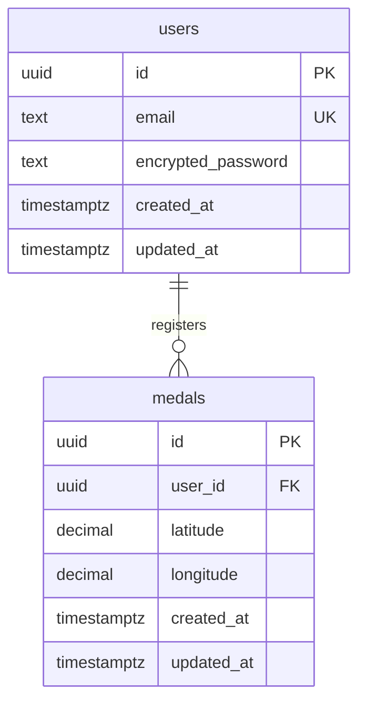

# 機能設計書

## 機能一覧

### MVP機能

| 機能ID | 機能名 | 概要 | 優先度 | 実装状況 |
|--------|--------|------|--------|----------|
| F001 | ユーザー認証・登録 | メール/パスワード認証、ログイン | 高 | 未実装 |
| F002 | メダル登録 | 現在位置へのメダル登録 | 高 | 未実装 |
| F003 | メダル表示 | マップ上のメダル一覧表示 | 高 | 未実装 |
| F004 | メダル削除 | 自分が登録したメダルの削除 | 高 | 未実装 |
| F005 | マップ操作 | 地図の拡大縮小・移動 | 高 | 未実装 |

### 非機能要件

| 要件ID | 要件名 | 基準値 | 備考 |
|--------|--------|--------|------|
| NFR001 | アプリ起動時間 | 3秒以内 | パフォーマンス |
| NFR002 | メダル登録レスポンス | 2秒以内 | パフォーマンス |
| NFR003 | マップ初期表示 | 3秒以内 | パフォーマンス |
| NFR004 | 同時アクティブユーザー | 1,000人 | スケーラビリティ |
| NFR005 | データ暗号化 | HTTPS/TLS、bcrypt | セキュリティ |
| NFR006 | データバックアップ | 日次自動バックアップ | 運営・保守 |
| NFR007 | サポート体制 | ベストエフォート | 運営・保守 |

---

## ユーザー認証・登録機能【F001】

ユーザーの新規登録とログイン認証を管理する機能。

### 機能概要
- **メールアドレス認証**: メールアドレスとパスワードによる認証
- **セッション管理**: JWTトークンによるセッション管理
- **パスワードリセット**: メールによるパスワードリセット機能

### 登録フロー
1. メールアドレス・パスワード入力
2. 利用規約・プライバシーポリシー同意
3. メール認証（確認メール送信）
4. 会員登録完了

### ログインフロー
1. メールアドレス・パスワード入力
2. JWT認証
3. セッション確立
4. ホーム画面（マップ画面）へ遷移

### データベース設計

**使用テーブル**:
- **auth.users**: Supabase Authの標準ユーザーテーブル
  - id (UUID, PK)
  - email (TEXT, UNIQUE)
  - encrypted_password (TEXT)
  - created_at (TIMESTAMPTZ)
  - updated_at (TIMESTAMPTZ)

### API設計

**Supabase Auth API使用**:
- `supabase.auth.signUp()`: 新規登録
- `supabase.auth.signInWithPassword()`: ログイン
- `supabase.auth.signOut()`: ログアウト
- `supabase.auth.resetPasswordForEmail()`: パスワードリセット

### セキュリティ要件
- パスワード: 8文字以上、英数字混在推奨
- パスワードのbcryptハッシュ化（Supabase Authが自動処理）
- ブルートフォース攻撃対策（Supabase Authが自動処理）
- セッションタイムアウト（24時間）

---

## メダル登録機能【F002】

現在位置にメダルが存在することを登録する機能。

### 機能概要
- 現在のGPS座標を取得
- 5メートル以内の重複をチェック
- メダル情報をデータベースに登録
- 登録完了後、マップに即座に反映

### 登録フロー
1. ユーザーが「登録」ボタンをタップ
2. GPS座標を取得
3. 5メートル以内の重複チェック（Edge Function）
4. 重複がなければデータベースに登録
5. マップ上に新しいメダルを表示

### 5メートル重複チェックロジック
```sql
-- Haversine距離計算で5メートル以内のメダルを検索
SELECT * FROM medals
WHERE (
  6371000 * acos(
    cos(radians(:new_latitude)) *
    cos(radians(latitude)) *
    cos(radians(longitude) - radians(:new_longitude)) +
    sin(radians(:new_latitude)) *
    sin(radians(latitude))
  )
) <= 5;
```

### データベース設計

**medalsテーブル**:
```sql
CREATE TABLE medals (
  id UUID PRIMARY KEY DEFAULT gen_random_uuid(),
  user_id UUID NOT NULL REFERENCES auth.users(id) ON DELETE CASCADE,
  latitude DECIMAL(10, 8) NOT NULL,
  longitude DECIMAL(11, 8) NOT NULL,
  created_at TIMESTAMPTZ DEFAULT now(),
  updated_at TIMESTAMPTZ DEFAULT now()
);

-- 地理インデックス
CREATE INDEX idx_medals_location ON medals (latitude, longitude);

-- ユーザーIDインデックス
CREATE INDEX idx_medals_user_id ON medals (user_id);
```

### Row Level Security (RLS) ポリシー
```sql
-- 全員が閲覧可能
CREATE POLICY "Medals are viewable by everyone" ON medals
  FOR SELECT USING (true);

-- 認証済みユーザーのみ登録可能（Edge Function経由）
-- クライアントからの直接登録は禁止
CREATE POLICY "Authenticated users can insert medals via Edge Functions" ON medals
  FOR INSERT WITH CHECK (false);

-- ユーザーは自分のメダルのみ削除可能（Edge Function経由）
CREATE POLICY "Users can delete their own medals via Edge Functions" ON medals
  FOR DELETE USING (false);
```

### API設計（Edge Functions）

#### `registerMedal` Edge Function
**エンドポイント**: `POST /functions/v1/registerMedal`

**リクエスト**:
```json
{
  "latitude": 35.6812362,
  "longitude": 139.7671248
}
```

**処理フロー**:
1. JWTトークンからuser_idを取得
2. 緯度経度のバリデーション
3. 5メートル以内の重複チェック
4. 重複がなければINSERT
5. レスポンス返却

**レスポンス（成功）**:
```json
{
  "success": true,
  "medal_id": "uuid-string",
  "message": "メダルを登録しました"
}
```

**レスポンス（重複エラー）**:
```json
{
  "success": false,
  "error": "DUPLICATE_MEDAL",
  "message": "5メートル以内に既に登録されているメダルがあります"
}
```

### 画面設計
- 登録ボタン: 画面下部に大きく配置（歩きながら操作するため）
- 登録中インジケーター: ローディング表示
- 成功/失敗メッセージ: トースト通知

---

## メダル表示機能【F003】

マップ上に登録されたメダルを表示する機能。

### 機能概要
- マップ初期表示時に現在地周辺のメダルを取得
- 自分が登録したメダルと他人のメダルを異なる色で表示
- マップ移動時に表示範囲のメダルを動的に取得

### 表示仕様
- **自分のメダル**: 青色のマーカー
- **他人のメダル**: 赤色のマーカー
- **マーカーサイズ**: タップしやすい大きさ（直径40px）

### データ取得方法

**クライアントから直接PostgreSQLクエリ（読み取りのみ）**:
```typescript
const { data: medals } = await supabase
  .from('medals')
  .select('*')
  .gte('latitude', southWestLat)
  .lte('latitude', northEastLat)
  .gte('longitude', southWestLng)
  .lte('longitude', northEastLng);
```

### 表示最適化
- **表示範囲制限**: 現在表示中のマップ範囲内のメダルのみ取得
- **取得上限**: 一度に最大1000件まで
- **キャッシュ**: 取得済みのメダルはクライアント側でキャッシュ

### マーカークラスタリング（将来実装）
メダル数が多い場合、ズームレベルに応じてクラスタリング表示

---

## メダル削除機能【F004】

自分が登録したメダルを削除する機能。

### 機能概要
- 自分のメダルをタップすると削除ボタンを表示
- 削除確認ダイアログ表示
- 削除後、マップから即座に削除

### 削除フロー
1. ユーザーが自分のメダルマーカーをタップ
2. 削除ボタンを含む吹き出しを表示
3. 削除ボタンをタップ
4. 確認ダイアログ表示「このメダルを削除しますか?」
5. 「削除」を選択
6. Edge Function呼び出し
7. 削除成功後、マップから削除

### API設計（Edge Functions）

#### `deleteMedal` Edge Function
**エンドポイント**: `DELETE /functions/v1/deleteMedal`

**リクエスト**:
```json
{
  "medal_id": "uuid-string"
}
```

**処理フロー**:
1. JWTトークンからuser_idを取得
2. medal_idの所有者を確認（user_id一致チェック）
3. 所有者であればDELETE
4. レスポンス返却

**レスポンス（成功）**:
```json
{
  "success": true,
  "message": "メダルを削除しました"
}
```

**レスポンス（権限エラー）**:
```json
{
  "success": false,
  "error": "UNAUTHORIZED",
  "message": "このメダルを削除する権限がありません"
}
```

### 画面設計
- 吹き出しUI: メダルタップ時に表示
- 削除ボタン: 赤色、アイコン付き
- 確認ダイアログ: 誤操作防止

---

## マップ操作機能【F005】

地図の拡大縮小・移動機能。

### 機能概要
- ピンチイン/ピンチアウトでズーム
- スワイプでマップ移動
- 現在地ボタンで現在地へ移動
- ズームボタン（+/-）

### 使用ライブラリ
- **react-native-maps**: React Native用マップコンポーネント
- **@react-native-community/geolocation**: 位置情報取得

### マップ初期設定
```typescript
{
  latitude: 35.6812362,    // 東京駅を中心
  longitude: 139.7671248,
  latitudeDelta: 0.01,     // 表示範囲（約1km）
  longitudeDelta: 0.01,
}
```

### 位置情報パーミッション
- **iOS**: Info.plistに`NSLocationWhenInUseUsageDescription`を設定
- **Android**: AndroidManifest.xmlに`ACCESS_FINE_LOCATION`を設定
- 初回起動時にパーミッション取得

---

## 共通実装方針

### データベースアクセス方針【重要】

**読み取り操作**:
- ✅ クライアントから直接PostgreSQLクエリ可能（SELECT）
- RLSポリシーで全員閲覧可能に設定

**書き込み・削除操作**:
- ❌ クライアントから直接データベースにアクセス禁止
- ✅ 必ずEdge Functionを経由してDBアクセス
- ✅ Edge Function内でJWT認証を実施
- ✅ Edge Function内でバリデーションを実施

**理由**:
- セキュリティ要件への準拠
- ビジネスロジック（5メートル重複チェック等）のサーバー側集約
- データ整合性の保証
- RLSによる適切なアクセス制御

**実装例**:
```typescript
// ✅ 良い例: 読み取りはクライアントから直接
const { data } = await supabase.from('medals').select('*');

// ❌ 悪い例: 書き込みをクライアントから直接
const { data } = await supabase.from('medals').insert([medal]);

// ✅ 良い例: 書き込みはEdge Function経由
const response = await fetch(`${SUPABASE_FUNCTIONS_URL}/registerMedal`, {
  method: 'POST',
  headers: {
    'Authorization': `Bearer ${session.access_token}`,
    'Content-Type': 'application/json',
  },
  body: JSON.stringify({ latitude, longitude }),
});
```

---

## Edge Functions 実装詳細

### 共通処理

**JWT認証**:
```typescript
const authHeader = req.headers.get('Authorization');
const token = authHeader?.replace('Bearer ', '');
const { data: { user }, error } = await supabase.auth.getUser(token);

if (error || !user) {
  return new Response(
    JSON.stringify({ error: 'Unauthorized' }),
    { status: 401 }
  );
}
```

**エラーハンドリング**:
```typescript
try {
  // 処理
} catch (error) {
  console.error('Error:', error);
  return new Response(
    JSON.stringify({ error: 'Internal Server Error', message: error.message }),
    { status: 500 }
  );
}
```

### validateMedal Edge Function（共通バリデーション）

5メートル重複チェックなど、共通のバリデーションロジックを提供。

**エクスポート関数**:
```typescript
export async function checkDuplicateMedal(
  supabase: SupabaseClient,
  latitude: number,
  longitude: number
): Promise<boolean>
```

---

## 非機能要件実装方針

### パフォーマンス要件（NFR001-003）

#### アプリ起動時間（3秒以内）
**実装方針**:
- 初期ロードの最小化（遅延読み込み）
- スプラッシュ画面での体感速度向上
- マップライブラリの事前ロード

#### メダル登録レスポンス（2秒以内）
**実装方針**:
- Edge Functionの最適化
- データベースインデックスの活用
- 楽観的UI更新（登録即表示、エラー時に削除）

#### マップ初期表示（3秒以内）
**実装方針**:
- 表示範囲内のメダルのみ取得
- マーカーの遅延レンダリング
- キャッシュ活用

### スケーラビリティ要件（NFR004）

#### 同時アクティブユーザー（1,000人）
**実装方針**:
- Supabase無料プランの範囲内で対応
- データベース接続プーリング
- Edge Functionsの自動スケーリング
- 適切なインデックス設計

### セキュリティ要件（NFR005）

#### データ暗号化
**実装方針**:
- HTTPS/TLSによる通信暗号化
- パスワードのbcryptハッシュ化（Supabase Authが自動処理）
- JWTトークンによる認証
- Supabase RLSによるアクセス制御

### 運営・保守要件（NFR006-007）

#### データバックアップ（日次自動バックアップ）
**実装方針**:
- Supabaseの自動バックアップ機能を使用
- 無料プランの範囲内で保持
- Supabaseダッシュボードから手動リストア可能

#### サポート体制（ベストエフォート）
**実装方針**:
- GitHub Issuesによる問い合わせ受付
- Supabase Dashboardでのログ確認
- 個人開発のためベストエフォート対応

---

## 画面設計

### マップ画面（メイン画面）

**レイアウト**:
```
+----------------------------------+
|  [<] dqwfunメダルコンパス       |
+----------------------------------+
|                                  |
|                                  |
|         マップ表示領域            |
|         （全画面）                |
|                                  |
|  [現在地]              [+]       |
|                        [-]       |
|                                  |
+----------------------------------+
|       [メダルを登録]              |
+----------------------------------+
```

**UI要素**:
- ヘッダー: アプリ名、戻るボタン（設定画面へ）
- マップ: 全画面表示
- 現在地ボタン: 左下
- ズームボタン: 右下
- 登録ボタン: 最下部、幅広、大きい（歩きながら操作するため）

**メダルマーカー**:
- 自分のメダル: 青色の円形マーカー（直径40px）
- 他人のメダル: 赤色の円形マーカー（直径40px）
- タップ時: 吹き出し表示（自分のメダルの場合は削除ボタン表示）

### ログイン画面

**レイアウト**:
```
+----------------------------------+
|                                  |
|    dqwfunメダルコンパス          |
|                                  |
|  [メールアドレス]                 |
|  [パスワード]                     |
|                                  |
|  [ログイン]                       |
|                                  |
|  [新規登録はこちら]               |
|  [パスワードを忘れた方]           |
|                                  |
+----------------------------------+
```

### 新規登録画面

**レイアウト**:
```
+----------------------------------+
|  [<] 新規登録                    |
+----------------------------------+
|                                  |
|  [メールアドレス]                 |
|  [パスワード]                     |
|  [パスワード（確認）]             |
|                                  |
|  □ 利用規約に同意する            |
|                                  |
|  [登録]                          |
|                                  |
+----------------------------------+
```

---

## データモデル図



---

## API一覧

### Supabase Auth API（標準）
- `POST /auth/v1/signup` - 新規登録
- `POST /auth/v1/token?grant_type=password` - ログイン
- `POST /auth/v1/logout` - ログアウト
- `POST /auth/v1/recover` - パスワードリセット

### Edge Functions API（カスタム）
- `POST /functions/v1/registerMedal` - メダル登録
- `DELETE /functions/v1/deleteMedal` - メダル削除
- `POST /functions/v1/validateMedal` - メダルバリデーション（共通関数）

### PostgreSQL直接クエリ（読み取りのみ）
- `SELECT * FROM medals` - メダル一覧取得

---

## 将来拡張機能（Phase2）

### メダルカテゴリ機能
- メダルの種類（小さなメダル、ちいさなメダル等）を分類
- カテゴリごとに色分け表示

### フィルター機能
- 登録日時でフィルター（今日、今週、今月等）
- ユーザーでフィルター（自分のメダルのみ表示）

### 統計機能
- 総登録メダル数
- 自分の登録数ランキング
- エリア別メダル分布

### ソーシャル機能
- メダルへのコメント
- いいね機能
- メダル写真の添付
