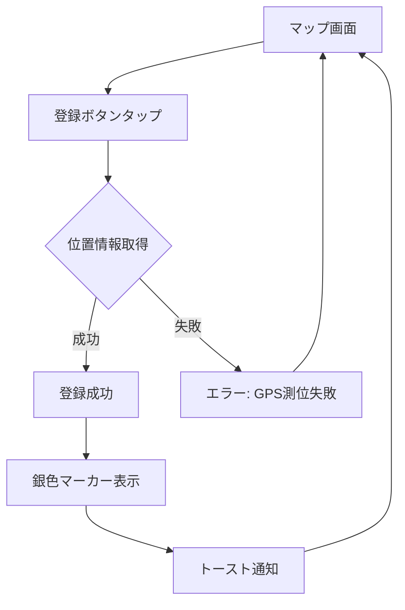
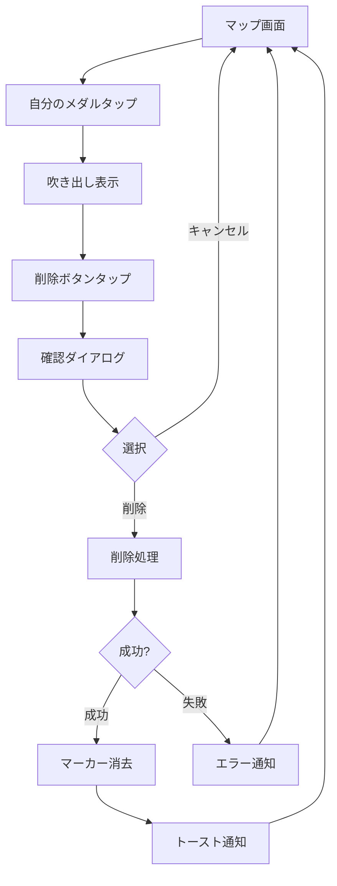

# 機能設計書

## 機能一覧

| 機能ID | 機能名 | 概要 |
|--------|--------|------|
| F001 | ユーザー認証・登録 | メール/パスワード認証、ログイン |
| F002 | メダル登録 | 現在位置へのメダル登録 |
| F003 | メダル表示 | マップ上のメダル一覧表示 |
| F004 | メダル削除 | 自分が登録したメダルの削除 |
| F005 | マップ操作 | 地図の拡大縮小・移動 |
| F006 | 誤メダル通報 | 不正なメダルを通報する機能 |
| F007 | ログイン情報記憶 | メールアドレスとパスワードの記憶機能 |
| F008 | モード切替 | 登録モードと探検モードの切替 |
| F009 | メダル獲得 | 探検モードでメダルを獲得扱いにする機能 |
| F010 | シーズン管理 | 年4回のシーズンごとのメダル管理とシーズン選択機能 |

### 非機能要件

| 要件ID | 要件名 | 基準値 | 備考 |
|--------|--------|--------|------|
| NFR001 | アプリ起動時間 | 3秒以内 | パフォーマンス |
| NFR002 | メダル登録レスポンス | 2秒以内 | パフォーマンス |
| NFR003 | マップ初期表示 | 3秒以内 | パフォーマンス |
| NFR004 | 同時アクティブユーザー | 1,000人 | スケーラビリティ |
| NFR005 | データ暗号化 | HTTPS/TLS、bcrypt | セキュリティ |
| NFR006 | データバックアップ | 日次自動バックアップ | 運営・保守 |
| NFR007 | サポート体制 | ベストエフォート | 運営・保守 |

---

## ユーザー認証・登録機能【F001】

ユーザーの新規登録とログイン認証を管理する機能。

### 機能概要
- メールアドレスとパスワードによるユーザー登録
- 登録済みユーザーのログイン
- パスワードを忘れた場合のリセット機能
- セッション管理（24時間有効）

### 利用シーン
- 初回起動時にアカウント作成
- 2回目以降の起動時にログイン
- パスワードを忘れた場合に再設定

### 登録フロー
1. アプリ起動
2. 「新規登録」をタップ
3. メールアドレス入力
4. パスワード入力（6文字以上）
5. パスワード確認入力
6. 利用規約・プライバシーポリシーに同意
7. 「登録」ボタンをタップ
8. 確認メールが送信される
9. メール内のリンクをクリックして認証完了
10. アプリに戻ってログイン

### ログインフロー
1. アプリ起動
2. メールアドレス入力
3. パスワード入力
4. 「ログイン」ボタンをタップ
5. マップ画面へ遷移

### パスワードリセットフロー
1. ログイン画面で「パスワードを忘れた方」をタップ
2. メールアドレス入力
3. 「送信」ボタンをタップ
4. パスワードリセットメールが送信される
5. メール内のリンクをクリック
6. 新しいパスワードを設定
7. ログイン画面に戻ってログイン

### 制約事項
- パスワードは6文字以上必須
- メールアドレスは有効な形式である必要がある
- 同じメールアドレスで重複登録不可
- セッションは24時間で自動的に期限切れ

### エラーケース
- メールアドレス形式が不正: 「有効なメールアドレスを入力してください」
- パスワードが短い: 「パスワードは6文字以上で入力してください」
- メールアドレスが既に登録済み: 「このメールアドレスは既に登録されています」
- ログイン失敗: 「メールアドレスまたはパスワードが正しくありません」
- ネットワークエラー: 「通信エラーが発生しました。しばらくしてから再度お試しください」

---

## メダル登録機能【F002】

現在位置にメダルが存在することを登録する機能。

### 機能概要
- 現在のGPS座標でメダルを登録
- 登録したメダルは即座にマップ上に表示される
- 登録したメダルは銀色で表示される

### 利用シーン
- ドラクエウォークをプレイ中に小さなメダルを見つけた時
- メダルの位置を他のユーザーと共有したい時

### 登録フロー
1. マップ画面で現在地に移動
2. 画面下部の「メダルを登録」ボタンをタップ
3. GPS座標を自動取得
4. 登録完了
5. マップ上に銀色のマーカーが表示される
6. 「登録しました」トースト通知が表示される

### 制約事項
- 位置情報パーミッションが必要
- ログイン済みユーザーのみ登録可能
- GPS測位精度が低い場合は警告表示

### エラーケース
- 位置情報パーミッション未許可: 「位置情報の利用を許可してください」
- GPS測位失敗: 「現在地を取得できませんでした。再度お試しください」
- ネットワークエラー: 「登録に失敗しました。再度お試しください」
- 未ログイン: 「ログインしてください」

### 成功条件
- GPS座標が正常に取得できる
- ユーザーがログイン済み
- ネットワーク接続が正常

---

## メダル表示機能【F003】

マップ上に登録されたメダルを表示する機能。

### 機能概要
- マップ初期表示時に現在地周辺のメダルを表示
- モードに応じてメダルの色が変化:
  - **登録モード**: 自分=金色、他人=グレー
  - **探検モード**: 未獲得=金色、獲得済み=グレー
- マップ移動時に表示範囲内のメダルを動的に取得
- メダルマーカーをタップすると情報を表示

### 利用シーン
- アプリ起動時にメダル位置を確認
- マップを移動して周辺のメダルを探す
- 特定のメダルの情報を確認

### 表示フロー
1. アプリ起動（ログイン後）
2. マップ画面が表示される（デフォルトは登録モード）
3. 現在地周辺のメダルが自動的に読み込まれる
4. 登録モードの場合: 自分のメダル（金色）と他人のメダル（グレー）が表示される
5. 探検モードの場合: 未獲得メダル（金色）と獲得済みメダル（グレー）が表示される
6. マップを移動すると新しい範囲のメダルが読み込まれる

### マーカータップ時の動作

**登録モード - 自分のメダル（金色）:**
1. メダルマーカーをタップ
2. 吹き出しが表示される
3. 登録日時が表示される
4. 「削除」ボタンが表示される

**登録モード - 他人のメダル（グレー）:**
1. メダルマーカーをタップ
2. 吹き出しが表示される
3. 登録日時が表示される
4. 通報数が表示される（3件以上の場合のみ）
5. 「誤メダルとして通報」ボタンが表示される（未通報の場合）
6. 「通報済み」バッジが表示される（通報済みの場合）

**探検モード - 未獲得メダル（金色）:**
1. メダルマーカーをタップ
2. 吹き出しが表示される
3. 登録日時が表示される
4. 「獲得する」ボタンが表示される

**探検モード - 獲得済みメダル（グレー）:**
1. メダルマーカーをタップ
2. 吹き出しが表示される
3. 登録日時と獲得日時が表示される
4. 「獲得をキャンセル」ボタンが表示される

### 表示仕様

**登録モード:**
- 自分のメダル: **金色**の円形マーカー（直径40px）
- 他人のメダル: **グレー**の円形マーカー（直径40px）

**探検モード:**
- 未獲得メダル: **金色**の円形マーカー（直径40px）
- 獲得済みメダル: **グレー**の円形マーカー（直径40px）

**共通:**
- 表示範囲: 現在のマップ表示範囲内のメダルのみ
- 最大表示数: 一度に最大1000件まで

### 制約事項
- マップの表示範囲内のメダルのみ取得
- 一度に1000件以上のメダルは表示しない
- ズームレベルが低い（広範囲）場合はメダル密度が高すぎて見づらくなる可能性

---

## メダル削除機能【F004】

自分が登録したメダルを削除する機能。

### 機能概要
- 自分のメダルマーカーをタップして削除
- 削除前に確認ダイアログを表示
- 削除後、マップから即座にメダルが消える

### 利用シーン
- 誤って登録してしまった場合
- メダルの位置が間違っていた場合
- 登録したメダルが不要になった場合

### 削除フロー
1. マップ上の自分のメダル（銀色）をタップ
2. 吹き出しが表示される
3. 「削除」ボタンをタップ
4. 確認ダイアログが表示される「このメダルを削除しますか？」
5. 「削除」を選択
6. メダルがデータベースから削除される
7. マップ上からメダルマーカーが消える
8. 「削除しました」トースト通知が表示される

### 制約事項
- 自分が登録したメダルのみ削除可能
- 他人のメダルは削除できない
- 削除後の復元は不可
- ログイン済みユーザーのみ削除可能

### エラーケース
- 他人のメダルを削除しようとした場合: 削除ボタンが表示されない
- ネットワークエラー: 「削除に失敗しました。再度お試しください」
- 権限エラー: 「このメダルを削除する権限がありません」

### 確認ダイアログ
- タイトル: 「メダルを削除」
- メッセージ: 「このメダルを削除しますか？\n削除後は復元できません。」
- ボタン: 「キャンセル」「削除」

---

## マップ操作機能【F005】

地図の拡大縮小・移動機能。

### 機能概要
- ピンチイン/ピンチアウトでズーム
- スワイプでマップ移動
- 現在地ボタンで現在地へ移動
- ズームボタン（+/-）でズームレベル調整

### 利用シーン
- メダルの詳細な位置を確認するためにズームイン
- 広範囲のメダル分布を確認するためにズームアウト
- マップを移動して周辺地域を探索
- 現在地に戻る

### 操作方法

**ズーム操作:**
- ピンチイン: 2本指で画面を広げる → ズームイン（拡大）
- ピンチアウト: 2本指で画面を縮める → ズームアウト（縮小）
- ＋ボタンタップ: ズームイン
- －ボタンタップ: ズームアウト

**移動操作:**
- スワイプ: 指で画面をドラッグしてマップを移動
- 現在地ボタンタップ: 現在地を中心にマップを移動

**マップの種類:**
- 標準地図: デフォルトの地図表示
- 衛星写真: 衛星写真モード（将来実装）

### 初期表示設定
- 中心座標: ユーザーの現在地（位置情報取得可能な場合）
- フォールバック: 東京駅（位置情報取得失敗時）
- ズームレベル: 約1km範囲が表示される程度

### UI要素配置
- **現在地ボタン**: 画面左下
- **ズーム＋ボタン**: 画面右下上
- **ズーム－ボタン**: 画面右下下
- **メダル登録ボタン**: 画面最下部（固定）

### 制約事項
- 位置情報パーミッションがないと現在地ボタンが使えない
- 最大ズームレベル: 建物レベル
- 最小ズームレベル: 日本全体が見える程度

---

## 誤メダル通報機能【F006】

不正なメダル（メダルのない位置に登録されたメダル）を通報する機能。

### 機能概要
- 他人のメダルマーカーをタップして「誤メダル」として通報
- 通報データは蓄積され、運営が確認可能
- メダル削除・ユーザーBAN判断は運営が手動で実施
- 同一ユーザーが同一メダルに複数回通報することは不可

### 利用シーン
- 実際にその場所に行ったがメダルがなかった場合
- 明らかに不正な位置（海上、山中など）にメダルが登録されている場合
- 悪意あるユーザーの不正登録を発見した場合

### 通報フロー
1. マップ上の他人のメダル（黄色）をタップ
2. 吹き出しが表示される
3. 「誤メダルとして通報」ボタンをタップ
4. 確認ダイアログが表示される「このメダルを通報しますか？」
5. 「通報する」を選択
6. 通報が記録される
7. 「通報しました」トースト通知が表示される
8. 通報データは運営が確認できるように蓄積される

### 表示仕様
- **通報済みメダル**: 自分が通報済みのメダルには「通報済み」バッジを表示
- **通報数表示**: 吹き出しに「通報数: X件」を表示（3件以上の場合のみ）
- **削除メダル**: 運営が削除したメダルは全ユーザーから非表示

### 制約事項
- 自分が登録したメダルは通報できない
- 同一メダルに対して1ユーザー1回のみ通報可能
- ログイン済みユーザーのみ通報可能
- 通報の取り消しは不可

### エラーケース
- 自分のメダルを通報しようとした場合: 通報ボタンが表示されない
- 既に通報済みのメダル: 「既に通報済みです」
- 未ログイン: 「ログインしてください」
- ネットワークエラー: 「通報に失敗しました。再度お試しください」

### 確認ダイアログ
- タイトル: 「誤メダルとして通報」
- メッセージ: 「このメダルを誤メダルとして通報しますか？\n通報は取り消せません。」
- ボタン: 「キャンセル」「通報する」

### ユーザーBAN
- 運営が通報履歴を確認し、悪質なユーザーを手動でBANする
- BAN状態のユーザーのメダルは全て非表示
- BAN解除も運営による手動対応

### 通報の悪用防止
- 虚偽通報に対しては、運営がSupabaseダッシュボードから通報履歴を確認
- 悪質な虚偽通報を繰り返すユーザーは、運営が手動でBAN

---

## ログイン情報記憶機能【F007】

ユーザーの利便性向上のため、ログイン画面でメールアドレスとパスワードを記憶する機能。

### 機能概要
- チェックボックスでログイン情報の記憶をON/OFF
- ログイン成功時にメールアドレスとパスワードをSecureStoreに暗号化保存
- 次回ログイン時に保存された情報を自動入力
- チェックボックスOFFでログアウト時に保存情報を削除

### 利用シーン
- 毎回メールアドレスとパスワードを入力するのが面倒な場合
- 個人のスマートフォンで使用する場合（共有デバイスでは非推奨）
- 頻繁にログイン/ログアウトを繰り返す場合

### 記憶機能のフロー

**初回ログイン（記憶ON）:**
1. ログイン画面を開く
2. メールアドレスとパスワードを入力
3. 「ログイン情報を記憶する」にチェック
4. 「ログイン」ボタンをタップ
5. ログイン成功
6. メールアドレスとパスワードがSecureStoreに暗号化保存される

**2回目以降のログイン:**
1. ログイン画面を開く
2. メールアドレスとパスワードが自動的に入力済み
3. チェックボックスもON
4. 「ログイン」ボタンをタップするだけでログイン可能

**記憶を解除する場合:**
1. ログイン画面で「ログイン情報を記憶する」のチェックを外す
2. ログインする
3. その後ログアウトすると、保存情報が削除される

### データ保存仕様

**保存先**: Expo SecureStore（iOS Keychain / Android Keystore）

**保存するキー:**
| キー名 | 値 | 説明 |
|--------|-----|------|
| `saved_email` | メールアドレス（文字列） | ユーザーのメールアドレス |
| `saved_password` | パスワード（文字列） | ユーザーのパスワード（OS暗号化） |
| `remember_credentials` | "true" / "false" | 記憶機能ON/OFF状態 |

### データフロー

```
【ログイン成功時】
  ↓
チェックボックスがON？
  ↓ YES
SecureStoreに保存:
  - saved_email
  - saved_password
  - remember_credentials = "true"

【ログイン画面表示時】
  ↓
remember_credentials を確認
  ↓ "true"
SecureStoreから取得:
  - saved_email → メールアドレス入力欄に自動入力
  - saved_password → パスワード入力欄に自動入力
  - チェックボックスをON

【ログアウト時】
  ↓
remember_credentials を確認
  ↓ "false"
SecureStoreから削除:
  - saved_email
  - saved_password
  - remember_credentials
```

### 制約事項
- デバイスローカルのみに保存（サーバーには保存しない）
- 共有デバイスでの使用は非推奨
- デフォルトはOFF（ユーザーが明示的にONにする必要がある）
- アプリ削除時に保存情報も削除される
- OSのセキュリティ設定（PINロック、生体認証）に依存

### エラーケース
- SecureStore保存失敗: エラーを無視（ログイン機能に影響させない）
- SecureStore読み込み失敗: エラーを無視（空欄でログイン画面表示）
- 保存情報でログイン失敗: 通常のログインエラーと同じ処理

### 実装対象ファイル

**新規作成:**
- `src/utils/secureStorage.ts`: SecureStore操作のユーティリティ関数

**変更:**
- `src/screens/LoginScreen.tsx`: チェックボックス追加、保存/読み込み処理
- `src/contexts/AuthContext.tsx`: ログアウト時のクリア処理

### テストケース

| テストID | テストケース | 期待結果 |
|---------|-------------|---------|
| TC-F007-1 | チェックONでログイン | 次回自動入力される |
| TC-F007-2 | チェックOFFでログイン | 次回自動入力されない |
| TC-F007-3 | チェックON→OFF→ログアウト | 保存情報が削除される |
| TC-F007-4 | 異なるアカウントでログイン | 新しいアカウント情報で上書き |
| TC-F007-5 | アプリ再起動 | 保存情報が維持される |
| TC-F007-6 | アプリアンインストール後再インストール | 保存情報は削除されている |
| TC-F007-7 | 保存情報でログイン失敗 | 通常のエラーメッセージ表示 |

### 非機能要件
- **パフォーマンス**: SecureStore読み込みは100ms以内
- **信頼性**: SecureStore操作失敗時はエラーを無視（ログイン機能に影響しない）
- **互換性**: iOS 13.0以上、Android 6.0以上（expo-secure-storeの要件）

※UI設計は[7_UI設計書.md](7_UI設計書.md#ログイン情報記憶機能ui)を参照
※セキュリティ詳細は[2_アーキテクチャ設計書.md](2_アーキテクチャ設計書.md#ログイン情報記憶機能のセキュリティ)を参照

---

## 操作フロー図

### メダル登録フロー


### メダル削除フロー


---

## モード切替機能【F008】

アプリには「登録モード」と「探検モード」の2つのモードがあり、ユーザーが切り替えることができる。

### 機能概要
- マップ画面でモードを切り替えるトグルボタンを配置
- 登録モード: メダルを登録する目的で使用
- 探検モード: 登録されたメダルを獲得しに行く目的で使用
- モードに応じてメダルの表示色が変化

### 利用シーン
- メダルを見つけて登録したいとき → 登録モード
- 登録されたメダルを獲得しに出かけるとき → 探検モード

### モード切替フロー
1. マップ画面上部のモード切替ボタンをタップ
2. 「登録モード」⇄「探検モード」がトグル
3. メダルマーカーの色が即座に変化
4. 現在のモードが視覚的に表示される

### 表示仕様

**登録モード:**
- 自分が登録したメダル: **金色**マーカー
- 他人が登録したメダル: **グレー**マーカー
- 登録ボタン: 表示
- メダルタップ: 削除/通報機能

**探検モード:**
- 未獲得メダル（全て）: **金色**マーカー
- 獲得済みメダル: **グレー**マーカー
- 登録ボタン: 非表示
- メダルタップ: 獲得/獲得キャンセル機能

### UI要素
- モード切替ボタン: 画面上部中央
- ボタンデザイン: トグルスイッチまたはセグメントコントロール
- ラベル: 「登録」「探検」

---

## メダル獲得機能【F009】

探検モードでメダルを獲得扱いにし、自分の獲得履歴を記録する機能。

### 機能概要
- 探検モードでメダルマーカーをタップして「獲得」扱いにする
- 獲得したメダルは**グレー**表示になる
- 獲得をキャンセルすることも可能（誤タップ対策）
- 獲得履歴はユーザーごとにデータベースに保存

### 利用シーン
- 登録されたメダルの場所に実際に行ってメダルを獲得したとき
- 自分が獲得したメダルと未獲得メダルを区別したいとき

### 獲得フロー
1. 探検モードに切り替え
2. 金色のメダルマーカーをタップ
3. 吹き出しに「獲得する」ボタンが表示される
4. 「獲得する」ボタンをタップ
5. メダルが**グレー**に変化
6. 獲得履歴がデータベースに保存される
7. トースト通知「メダルを獲得しました」

### 獲得キャンセルフロー
1. グレー表示のメダルマーカーをタップ
2. 吹き出しに「獲得をキャンセル」ボタンが表示される
3. 「獲得をキャンセル」ボタンをタップ
4. メダルが**金色**に戻る
5. 獲得履歴がデータベースから削除される
6. トースト通知「獲得をキャンセルしました」

### データベース設計
新規テーブル: `medal_collections`（メダル獲得履歴）
- `id` (bigint, 主キー, 自動採番)
- `user_id` (uuid, auth.usersへの外部キー)
- `medal_no` (bigint, medalsへの外部キー)
- `collected_at` (timestamptz, NOT NULL) - 獲得日時
- UNIQUE制約: (user_id, medal_no) - 重複獲得防止

### 制約事項
- 探検モードでのみ獲得機能が有効
- 登録モードでは獲得ボタンは表示されない
- 同一メダルを複数回獲得することは不可（UNIQUE制約）
- ログイン済みユーザーのみ獲得可能

### エラーケース
- 未ログイン: 「ログインしてください」
- ネットワークエラー: 「獲得の記録に失敗しました」
- 重複獲得エラー: 「既に獲得済みです」（通常発生しない）

---

## シーズン管理機能【F010】

メダル位置を年4回（春・夏・秋・冬）のシーズンごとに管理し、過去のシーズンも閲覧できる機能。

### 機能概要
- メダルは各シーズンに紐付けて管理される
- マイページでシーズンを選択可能
- 現在シーズン：全機能利用可能
- 過去シーズン：閲覧専用（登録・獲得・削除・通報不可）

### 利用シーン
- 新しいシーズンが始まったときに現在シーズンに切り替える
- 過去のシーズンで獲得したメダルの位置を確認したい
- 過去のシーズンの獲得履歴を振り返りたい

### シーズン表記
- 形式：`YYYY/春`、`YYYY/夏`、`YYYY/秋`、`YYYY/冬`
- 初期シーズン：`2025/秋`
- 例：`2025/秋`、`2025/冬`、`2026/春`

### シーズン選択フロー
1. マイページ画面を開く
2. シーズン選択ドロップダウンをタップ
3. シーズン一覧が表示される（降順）
4. 選択したいシーズンをタップ
5. マップ画面に戻る
6. 選択したシーズンのメダルが表示される

### 現在シーズンの動作
- **表示**：選択したシーズンのメダルのみ表示
- **登録**：可能（選択シーズンで登録される）
- **獲得**：可能（獲得履歴に記録）
- **削除**：可能（自分のメダルのみ）
- **通報**：可能
- **モード切替**：表示

### 過去シーズンの動作
- **表示**：選択したシーズンのメダルのみ表示（閲覧専用）
- **登録**：不可
- **獲得**：不可
- **削除**：不可
- **通報**：不可
- **モード切替**：非表示
- **獲得履歴**：過去の獲得記録を閲覧可能

### UI表示
**シーズン表示箇所：**
- マイページのみに表示
- ホーム画面（マップ画面）には表示しない
- メダルの思い出画面（獲得履歴）には表示しない

**現在シーズン選択時：**
- マイページに「現在のシーズン：2025/秋」と表示
- モード切替ボタンを表示
- 通常通りの操作が可能

**過去シーズン選択時：**
- マイページに「選択中のシーズン：2024/夏（過去）」と表示
- モード切替ボタンを非表示
- 「閲覧専用モード」の説明テキストをマイページに表示
- メダルタップ時に操作ボタン（削除・通報・獲得）を非表示

### シーズン一覧の取得
- データベースから登録済みメダルのシーズン一覧を取得
- 重複を除外してユニークなシーズンリストを生成
- 降順でソート（新しいシーズンが上）

### 制約事項
- シーズンは手動で設定（自動切り替えなし）
- 過去シーズンのデータは削除不可
- 現在シーズンの判定は最新のシーズンかどうかで行う

### エラーケース
- シーズン切り替え失敗：「シーズンの切り替えに失敗しました」
- シーズン一覧取得失敗：「シーズン情報の取得に失敗しました」

---

## 用語集

| 用語 | 説明 |
|------|------|
| メダル | ドラクエウォークの小さなメダルの湧き位置 |
| マーカー | マップ上のメダル位置を示すアイコン |
| GPS座標 | 緯度と経度で表される位置情報 |
| 吹き出し | マーカータップ時に表示される情報ウィンドウ |
| トースト通知 | 画面下部に短時間表示されるメッセージ |
| セッション | ログイン状態の有効期間 |
| 誤メダル | メダルのない位置に不正に登録されたメダル |
| 通報 | 誤メダルを運営に報告する行為 |
| 無効化 | 5通報以上のメダルが非表示になること |
| BAN | 10回通報を受けたユーザーの全メダルが無効化される状態 |
| 登録モード | メダルを登録する目的のモード。自分のメダル=金色、他人=グレー |
| 探検モード | メダルを獲得しに行く目的のモード。未獲得=金色、獲得済み=グレー |
| 獲得 | 探検モードでメダルを獲得扱いにし、履歴に記録すること |
| 獲得履歴 | ユーザーがどのメダルを獲得したかの記録 |
| シーズン | 年4回（春・夏・秋・冬）のメダル管理期間。YYYY/春の形式で表記 |
| 現在シーズン | 最新のシーズン。全機能が利用可能 |
| 過去シーズン | 現在より前のシーズン。閲覧専用 |

