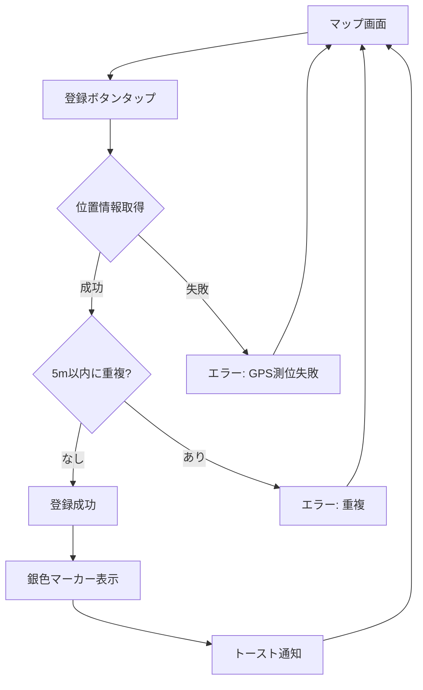
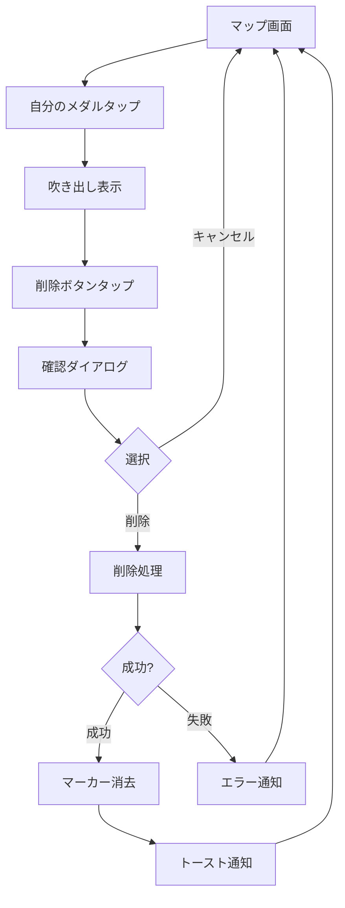

# 機能設計書

## 機能一覧

| 機能ID | 機能名 | 概要 |
|--------|--------|------|
| F001 | ユーザー認証・登録 | メール/パスワード認証、ログイン |
| F002 | メダル登録 | 現在位置へのメダル登録 |
| F003 | メダル表示 | マップ上のメダル一覧表示 |
| F004 | メダル削除 | 自分が登録したメダルの削除 |
| F005 | マップ操作 | 地図の拡大縮小・移動 |
| F006 | 誤メダル通報 | 不正なメダルを通報する機能 |

### 非機能要件

| 要件ID | 要件名 | 基準値 | 備考 |
|--------|--------|--------|------|
| NFR001 | アプリ起動時間 | 3秒以内 | パフォーマンス |
| NFR002 | メダル登録レスポンス | 2秒以内 | パフォーマンス |
| NFR003 | マップ初期表示 | 3秒以内 | パフォーマンス |
| NFR004 | 同時アクティブユーザー | 1,000人 | スケーラビリティ |
| NFR005 | データ暗号化 | HTTPS/TLS、bcrypt | セキュリティ |
| NFR006 | データバックアップ | 日次自動バックアップ | 運営・保守 |
| NFR007 | サポート体制 | ベストエフォート | 運営・保守 |

---

## ユーザー認証・登録機能【F001】

ユーザーの新規登録とログイン認証を管理する機能。

### 機能概要
- メールアドレスとパスワードによるユーザー登録
- 登録済みユーザーのログイン
- パスワードを忘れた場合のリセット機能
- セッション管理（24時間有効）

### 利用シーン
- 初回起動時にアカウント作成
- 2回目以降の起動時にログイン
- パスワードを忘れた場合に再設定

### 登録フロー
1. アプリ起動
2. 「新規登録」をタップ
3. メールアドレス入力
4. パスワード入力（8文字以上）
5. パスワード確認入力
6. 利用規約・プライバシーポリシーに同意
7. 「登録」ボタンをタップ
8. 確認メールが送信される
9. メール内のリンクをクリックして認証完了
10. アプリに戻ってログイン

### ログインフロー
1. アプリ起動
2. メールアドレス入力
3. パスワード入力
4. 「ログイン」ボタンをタップ
5. マップ画面へ遷移

### パスワードリセットフロー
1. ログイン画面で「パスワードを忘れた方」をタップ
2. メールアドレス入力
3. 「送信」ボタンをタップ
4. パスワードリセットメールが送信される
5. メール内のリンクをクリック
6. 新しいパスワードを設定
7. ログイン画面に戻ってログイン

### 制約事項
- パスワードは8文字以上必須
- メールアドレスは有効な形式である必要がある
- 同じメールアドレスで重複登録不可
- セッションは24時間で自動的に期限切れ

### エラーケース
- メールアドレス形式が不正: 「有効なメールアドレスを入力してください」
- パスワードが短い: 「パスワードは8文字以上で入力してください」
- メールアドレスが既に登録済み: 「このメールアドレスは既に登録されています」
- ログイン失敗: 「メールアドレスまたはパスワードが正しくありません」
- ネットワークエラー: 「通信エラーが発生しました。しばらくしてから再度お試しください」

---

## メダル登録機能【F002】

現在位置にメダルが存在することを登録する機能。

### 機能概要
- 現在のGPS座標でメダルを登録
- 5メートル以内に既存のメダルがある場合は登録不可
- 登録したメダルは即座にマップ上に表示される
- 登録したメダルは銀色で表示される

### 利用シーン
- ドラクエウォークをプレイ中に小さなメダルを見つけた時
- メダルの位置を他のユーザーと共有したい時

### 登録フロー
1. マップ画面で現在地に移動
2. 画面下部の「メダルを登録」ボタンをタップ
3. GPS座標を自動取得
4. 5メートル以内の重複をチェック
5. 重複がなければ登録完了
6. マップ上に銀色のマーカーが表示される
7. 「登録しました」トースト通知が表示される

### 制約事項
- 位置情報パーミッションが必要
- 5メートル以内に既存のメダルがある場合は登録不可
- ログイン済みユーザーのみ登録可能
- GPS測位精度が低い場合は警告表示

### エラーケース
- 位置情報パーミッション未許可: 「位置情報の利用を許可してください」
- GPS測位失敗: 「現在地を取得できませんでした。再度お試しください」
- 5メートル以内に重複: 「5メートル以内に既に登録されているメダルがあります」
- ネットワークエラー: 「登録に失敗しました。再度お試しください」
- 未ログイン: 「ログインしてください」

### 成功条件
- GPS座標が正常に取得できる
- 5メートル以内に既存メダルがない
- ユーザーがログイン済み
- ネットワーク接続が正常

---

## メダル表示機能【F003】

マップ上に登録されたメダルを表示する機能。

### 機能概要
- マップ初期表示時に現在地周辺のメダルを表示
- 自分が登録したメダルは銀色、他人のメダルは黄色で表示
- マップ移動時に表示範囲内のメダルを動的に取得
- メダルマーカーをタップすると情報を表示

### 利用シーン
- アプリ起動時にメダル位置を確認
- マップを移動して周辺のメダルを探す
- 特定のメダルの情報を確認

### 表示フロー
1. アプリ起動（ログイン後）
2. マップ画面が表示される
3. 現在地周辺のメダルが自動的に読み込まれる
4. 自分のメダル（銀色）と他人のメダル（黄色）が表示される
5. マップを移動すると新しい範囲のメダルが読み込まれる

### マーカータップ時の動作
**自分のメダルの場合:**
1. メダルマーカーをタップ
2. 吹き出しが表示される
3. 登録日時が表示される
4. 「削除」ボタンが表示される

**他人のメダルの場合:**
1. メダルマーカーをタップ
2. 吹き出しが表示される
3. 登録日時が表示される
4. 通報数が表示される（3件以上の場合のみ）
5. 「誤メダルとして通報」ボタンが表示される（未通報の場合）
6. 「通報済み」バッジが表示される（通報済みの場合）

### 表示仕様
- **自分のメダル**: 銀色の円形マーカー（直径40px）
- **他人のメダル**: 黄色の円形マーカー（直径40px）
- **表示範囲**: 現在のマップ表示範囲内のメダルのみ
- **最大表示数**: 一度に最大1000件まで

### 制約事項
- マップの表示範囲内のメダルのみ取得
- 一度に1000件以上のメダルは表示しない
- ズームレベルが低い（広範囲）場合はメダル密度が高すぎて見づらくなる可能性

---

## メダル削除機能【F004】

自分が登録したメダルを削除する機能。

### 機能概要
- 自分のメダルマーカーをタップして削除
- 削除前に確認ダイアログを表示
- 削除後、マップから即座にメダルが消える

### 利用シーン
- 誤って登録してしまった場合
- メダルの位置が間違っていた場合
- 登録したメダルが不要になった場合

### 削除フロー
1. マップ上の自分のメダル（銀色）をタップ
2. 吹き出しが表示される
3. 「削除」ボタンをタップ
4. 確認ダイアログが表示される「このメダルを削除しますか？」
5. 「削除」を選択
6. メダルがデータベースから削除される
7. マップ上からメダルマーカーが消える
8. 「削除しました」トースト通知が表示される

### 制約事項
- 自分が登録したメダルのみ削除可能
- 他人のメダルは削除できない
- 削除後の復元は不可
- ログイン済みユーザーのみ削除可能

### エラーケース
- 他人のメダルを削除しようとした場合: 削除ボタンが表示されない
- ネットワークエラー: 「削除に失敗しました。再度お試しください」
- 権限エラー: 「このメダルを削除する権限がありません」

### 確認ダイアログ
- タイトル: 「メダルを削除」
- メッセージ: 「このメダルを削除しますか？\n削除後は復元できません。」
- ボタン: 「キャンセル」「削除」

---

## マップ操作機能【F005】

地図の拡大縮小・移動機能。

### 機能概要
- ピンチイン/ピンチアウトでズーム
- スワイプでマップ移動
- 現在地ボタンで現在地へ移動
- ズームボタン（+/-）でズームレベル調整

### 利用シーン
- メダルの詳細な位置を確認するためにズームイン
- 広範囲のメダル分布を確認するためにズームアウト
- マップを移動して周辺地域を探索
- 現在地に戻る

### 操作方法

**ズーム操作:**
- ピンチイン: 2本指で画面を広げる → ズームイン（拡大）
- ピンチアウト: 2本指で画面を縮める → ズームアウト（縮小）
- ＋ボタンタップ: ズームイン
- －ボタンタップ: ズームアウト

**移動操作:**
- スワイプ: 指で画面をドラッグしてマップを移動
- 現在地ボタンタップ: 現在地を中心にマップを移動

**マップの種類:**
- 標準地図: デフォルトの地図表示
- 衛星写真: 衛星写真モード（将来実装）

### 初期表示設定
- 中心座標: ユーザーの現在地（位置情報取得可能な場合）
- フォールバック: 東京駅（位置情報取得失敗時）
- ズームレベル: 約1km範囲が表示される程度

### UI要素配置
- **現在地ボタン**: 画面左下
- **ズーム＋ボタン**: 画面右下上
- **ズーム－ボタン**: 画面右下下
- **メダル登録ボタン**: 画面最下部（固定）

### 制約事項
- 位置情報パーミッションがないと現在地ボタンが使えない
- 最大ズームレベル: 建物レベル
- 最小ズームレベル: 日本全体が見える程度

---

## 誤メダル通報機能【F006】

不正なメダル（メダルのない位置に登録されたメダル）を通報する機能。

### 機能概要
- 他人のメダルマーカーをタップして「誤メダル」として通報
- 5ユーザーから通報されたメダルは自動的に無効化（非表示）
- 10回通報されたユーザーは全メダルが無効化（BAN状態）
- 同一ユーザーが同一メダルに複数回通報することは不可

### 利用シーン
- 実際にその場所に行ったがメダルがなかった場合
- 明らかに不正な位置（海上、山中など）にメダルが登録されている場合
- 悪意あるユーザーの不正登録を発見した場合

### 通報フロー
1. マップ上の他人のメダル（黄色）をタップ
2. 吹き出しが表示される
3. 「誤メダルとして通報」ボタンをタップ
4. 確認ダイアログが表示される「このメダルを通報しますか？」
5. 「通報する」を選択
6. 通報が記録される
7. 「通報しました」トースト通知が表示される
8. 通報数が5に達した場合、メダルが自動的に非表示になる

### 表示仕様
- **通報済みメダル**: 自分が通報済みのメダルには「通報済み」バッジを表示
- **通報数表示**: 吹き出しに「通報数: X件」を表示（3件以上の場合のみ）
- **無効化メダル**: 5通報以上のメダルは全ユーザーから非表示

### 制約事項
- 自分が登録したメダルは通報できない
- 同一メダルに対して1ユーザー1回のみ通報可能
- ログイン済みユーザーのみ通報可能
- 通報の取り消しは不可

### エラーケース
- 自分のメダルを通報しようとした場合: 通報ボタンが表示されない
- 既に通報済みのメダル: 「既に通報済みです」
- 未ログイン: 「ログインしてください」
- ネットワークエラー: 「通報に失敗しました。再度お試しください」

### 確認ダイアログ
- タイトル: 「誤メダルとして通報」
- メッセージ: 「このメダルを誤メダルとして通報しますか？\n通報は取り消せません。」
- ボタン: 「キャンセル」「通報する」

### ユーザーBAN
- ユーザーが10回通報を受けた場合、そのユーザーの全メダルが自動的に無効化
- BAN状態のユーザーのメダルは全て非表示
- BAN解除は管理者による手動対応のみ

### 通報の悪用防止
- 虚偽通報に対しては、管理者がSupabaseダッシュボードから通報履歴を確認
- 悪質な虚偽通報を繰り返すユーザーは、管理者が手動でBAN

---

## 画面設計

### マップ画面（メイン画面）

**画面構成:**
```
+----------------------------------+
|  [<] dqwfunメダルコンパス       |
+----------------------------------+
|                                  |
|                                  |
|         マップ表示領域            |
|         （全画面）                |
|    ・銀色マーカー: 自分のメダル    |
|    ・黄色マーカー: 他人のメダル    |
|                                  |
|  [現在地]              [+]       |
|                        [-]       |
|                                  |
+----------------------------------+
|       [メダルを登録]              |
+----------------------------------+
```

**UI要素:**
- ヘッダー: アプリ名、設定ボタン
- マップ: 全画面表示
- メダルマーカー: 銀色（自分）、黄色（他人）
- 現在地ボタン: 左下
- ズームボタン: 右下
- 登録ボタン: 最下部、幅広、大きい

**操作:**
- メダルマーカータップ: 吹き出し表示
- 登録ボタンタップ: メダル登録
- 現在地ボタンタップ: 現在地へ移動
- ズームボタンタップ: ズームイン/アウト

---

### ログイン画面

**画面構成:**
```
+----------------------------------+
|                                  |
|    dqwfunメダルコンパス          |
|                                  |
|  [メールアドレス]                 |
|  _____________________________   |
|                                  |
|  [パスワード]                     |
|  _____________________________   |
|                                  |
|  [ログイン]                       |
|                                  |
|  [新規登録はこちら]               |
|  [パスワードを忘れた方]           |
|                                  |
+----------------------------------+
```

**入力項目:**
- メールアドレス: テキスト入力（@必須）
- パスワード: パスワード入力（非表示）

**ボタン:**
- ログイン: メイン操作ボタン（大きく目立つ）
- 新規登録: テキストリンク
- パスワードを忘れた方: テキストリンク

---

### 新規登録画面

**画面構成:**
```
+----------------------------------+
|  [<] 新規登録                    |
+----------------------------------+
|                                  |
|  [メールアドレス]                 |
|  _____________________________   |
|                                  |
|  [パスワード]                     |
|  _____________________________   |
|                                  |
|  [パスワード（確認）]             |
|  _____________________________   |
|                                  |
|  □ 利用規約に同意する            |
|                                  |
|  [登録]                          |
|                                  |
+----------------------------------+
```

**入力項目:**
- メールアドレス: テキスト入力
- パスワード: パスワード入力（8文字以上）
- パスワード（確認）: パスワード入力（一致確認）
- 利用規約同意: チェックボックス

**バリデーション:**
- メールアドレス形式チェック
- パスワード長チェック（8文字以上）
- パスワード一致チェック
- 利用規約同意チェック

---

## 操作フロー図

### メダル登録フロー


### メダル削除フロー


---

## 用語集

| 用語 | 説明 |
|------|------|
| メダル | ドラクエウォークの小さなメダルの湧き位置 |
| マーカー | マップ上のメダル位置を示すアイコン |
| GPS座標 | 緯度と経度で表される位置情報 |
| 5メートル重複チェック | 既存メダルから5メートル以内の登録を防ぐ仕組み |
| 吹き出し | マーカータップ時に表示される情報ウィンドウ |
| トースト通知 | 画面下部に短時間表示されるメッセージ |
| セッション | ログイン状態の有効期間 |
| 誤メダル | メダルのない位置に不正に登録されたメダル |
| 通報 | 誤メダルを運営に報告する行為 |
| 無効化 | 5通報以上のメダルが非表示になること |
| BAN | 10回通報を受けたユーザーの全メダルが無効化される状態 |

