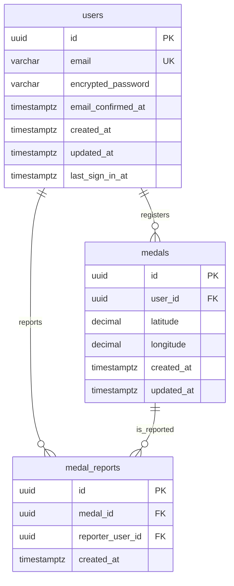

# データベース設計書

## 概要
本ドキュメントは、MedalCompass（dqwfunメダルコンパス）で使用するSupabase PostgreSQLデータベースのスキーマ設計を記載しています。ドラクエウォークの小さなメダルの湧き位置を登録・共有するために必要な最小限のテーブル構成を定義しています。

---

## データベース構成概要

### 使用データベース
- **Supabase PostgreSQL**: マネージドPostgreSQLデータベース
- **認証**: Supabase Auth（auth.usersテーブル）を使用
- **セキュリティ**: Row Level Security (RLS) を使用

### テーブル構成
MedalCompassは非常にシンプルな構成で、以下のスキーマを使用します：

1. **auth.users** (Supabase Auth標準テーブル) - ユーザー認証情報
2. **public.medals** (カスタムテーブル) - メダル位置情報
3. **public.medal_reports** (カスタムテーブル) - 誤メダル通報履歴

---

## テーブル一覧

| テーブル名 | スキーマ | 用途 | 管理者 |
|-----------|---------|------|--------|
| users | auth | ユーザー認証情報（メールアドレス、パスワード等） | Supabase Auth |
| medals | public | メダル位置情報（緯度、経度、登録者等） | アプリケーション |
| medal_reports | public | 誤メダル通報履歴（通報者、対象メダル、通報日時） | アプリケーション |

---

## 詳細テーブル定義

### 1. auth.users (Supabase Auth標準テーブル)

**用途**: ユーザー認証情報を管理する標準テーブル。Supabase Authにより自動的に管理される。

| カラム名 | データ型 | 制約 | 説明 |
|---------|---------|------|------|
| id | uuid | PK | ユーザーID（UUID v4） |
| email | varchar | UNIQUE, NOT NULL | メールアドレス |
| encrypted_password | varchar | NOT NULL | 暗号化されたパスワード（bcrypt） |
| email_confirmed_at | timestamptz | NULL | メール認証完了日時 |
| created_at | timestamptz | NOT NULL, DEFAULT now() | アカウント作成日時 |
| updated_at | timestamptz | NOT NULL, DEFAULT now() | 最終更新日時 |
| last_sign_in_at | timestamptz | NULL | 最終ログイン日時 |

**特徴**:
- Supabase Authにより自動管理
- パスワードは自動的にbcryptでハッシュ化
- JWT認証トークンの発行に使用
- メール認証フローをサポート

**RLS**: Supabase Authが自動管理

**インデックス**:
- `PRIMARY KEY (id)`
- `UNIQUE INDEX ON email`

---

### 2. public.medals (カスタムテーブル)

**用途**: ドラクエウォークの小さなメダルの湧き位置情報を保存。ユーザーが登録したメダルの緯度・経度情報を管理する。

| カラム名 | データ型 | 制約 | 説明 |
|---------|---------|------|------|
| id | uuid | PK, DEFAULT gen_random_uuid() | メダルID（UUID v4） |
| user_id | uuid | NOT NULL, FK → auth.users(id) ON DELETE CASCADE | 登録ユーザーID |
| latitude | decimal(10, 8) | NOT NULL | 緯度（-90.00000000 ～ 90.00000000） |
| longitude | decimal(11, 8) | NOT NULL | 経度（-180.00000000 ～ 180.00000000） |
| created_at | timestamptz | NOT NULL, DEFAULT now() | 登録日時 |
| updated_at | timestamptz | NOT NULL, DEFAULT now() | 最終更新日時 |

**特徴**:
- シンプルな構造で必要最小限の情報のみ保持
- 位置情報は小数点以下8桁で約1.1mmの精度
- user_idによりユーザーと紐付け（不正ユーザーの一括削除に使用）
- ON DELETE CASCADEによりユーザー削除時に関連メダルも自動削除

**RLS**: 有効（詳細は後述）

**インデックス**:
```sql
-- 主キー
PRIMARY KEY (id)

-- 地理座標検索用の複合インデックス
CREATE INDEX idx_medals_location ON medals (latitude, longitude);

-- ユーザーID検索用インデックス
CREATE INDEX idx_medals_user_id ON medals (user_id);

-- 作成日時検索用インデックス（将来的なデータ削除ポリシーに備えて）
CREATE INDEX idx_medals_created_at ON medals (created_at);
```

**制約**:
```sql
-- 外部キー制約
ALTER TABLE medals
  ADD CONSTRAINT fk_medals_user_id
  FOREIGN KEY (user_id)
  REFERENCES auth.users(id)
  ON DELETE CASCADE;

-- 緯度の範囲制約
ALTER TABLE medals
  ADD CONSTRAINT check_latitude
  CHECK (latitude >= -90 AND latitude <= 90);

-- 経度の範囲制約
ALTER TABLE medals
  ADD CONSTRAINT check_longitude
  CHECK (longitude >= -180 AND longitude <= 180);
```

---

### 3. public.medal_reports (カスタムテーブル)

**用途**: 誤メダル通報の履歴を保存。ユーザーがどのメダルを通報したかを記録し、通報数の集計に使用する。

| カラム名 | データ型 | 制約 | 説明 |
|---------|---------|------|------|
| id | uuid | PK, DEFAULT gen_random_uuid() | 通報ID（UUID v4） |
| medal_id | uuid | NOT NULL, FK → medals(id) ON DELETE CASCADE | 通報対象のメダルID |
| reporter_user_id | uuid | NOT NULL, FK → auth.users(id) ON DELETE CASCADE | 通報したユーザーID |
| created_at | timestamptz | NOT NULL, DEFAULT now() | 通報日時 |

**特徴**:
- 1ユーザーが1メダルに対して1回のみ通報可能（UNIQUE制約）
- メダル削除時に関連する通報履歴も自動削除（ON DELETE CASCADE）
- ユーザー削除時に関連する通報履歴も自動削除（ON DELETE CASCADE）

**RLS**: 有効（詳細は後述）

**インデックス**:
```sql
-- 主キー
PRIMARY KEY (id)

-- メダルIDと通報者の複合ユニークインデックス（重複通報防止）
CREATE UNIQUE INDEX idx_medal_reports_unique ON medal_reports (medal_id, reporter_user_id);

-- メダルID検索用インデックス（通報数カウント用）
CREATE INDEX idx_medal_reports_medal_id ON medal_reports (medal_id);

-- 通報者検索用インデックス（ユーザーの通報履歴用）
CREATE INDEX idx_medal_reports_reporter ON medal_reports (reporter_user_id);
```

**制約**:
```sql
-- 外部キー制約（メダル）
ALTER TABLE medal_reports
  ADD CONSTRAINT fk_medal_reports_medal_id
  FOREIGN KEY (medal_id)
  REFERENCES medals(id)
  ON DELETE CASCADE;

-- 外部キー制約（通報者）
ALTER TABLE medal_reports
  ADD CONSTRAINT fk_medal_reports_reporter
  FOREIGN KEY (reporter_user_id)
  REFERENCES auth.users(id)
  ON DELETE CASCADE;

-- 重複通報防止（同一ユーザーが同一メダルに複数回通報不可）
ALTER TABLE medal_reports
  ADD CONSTRAINT unique_medal_reporter
  UNIQUE (medal_id, reporter_user_id);
```

---

## Row Level Security (RLS) ポリシー

### 基本方針
MedalCompassでは、**読み取りは全員に公開**、**書き込み・削除は認証済みユーザーが自分のデータのみ操作可能**というセキュリティ設計を採用しています。Row Level Security (RLS)により、クライアントから直接データベースにアクセスしても、`auth.uid()`による自動的な認証制御が行われます。

### medals テーブルのRLSポリシー

#### 1. SELECT ポリシー（全員閲覧可能）
```sql
-- RLSを有効化
ALTER TABLE medals ENABLE ROW LEVEL SECURITY;

-- 全ユーザーが全メダルを閲覧可能（オープンデータとして公開）
CREATE POLICY "Medals are viewable by everyone"
  ON medals
  FOR SELECT
  USING (true);
```

**理由**:
- 要件定義書で「登録されたメダル位置はオープンデータとして全員が参照可能」と定義
- パフォーマンス向上のためクライアントから直接SELECT可能
- 位置情報のみで個人情報は含まれない

#### 2. INSERT ポリシー（認証済みユーザーのみ）
```sql
-- 認証済みユーザーは自分のuser_idでのみ登録可能
CREATE POLICY "Users can insert their own medals"
  ON medals
  FOR INSERT
  WITH CHECK (auth.uid() = user_id);
```

**理由**:
- `auth.uid()`で現在ログイン中のユーザーIDを自動取得
- user_idが一致する場合のみINSERTを許可
- 他人のuser_idで登録することは不可能
- 5メートル重複チェックはクライアント側で実施

#### 3. DELETE ポリシー（自分のメダルのみ削除可能）
```sql
-- 認証済みユーザーは自分のメダルのみ削除可能
CREATE POLICY "Users can delete their own medals"
  ON medals
  FOR DELETE
  USING (auth.uid() = user_id);
```

**理由**:
- `auth.uid()`で現在ログイン中のユーザーIDを自動取得
- user_idが一致するメダルのみDELETEを許可
- 他人のメダルは削除不可
- クライアントから直接削除可能でシンプル

#### 4. UPDATE ポリシー（更新機能なし）
```sql
-- 更新機能は提供しない（登録と削除のみ）
CREATE POLICY "No updates allowed"
  ON medals
  FOR UPDATE
  USING (false);
```

**理由**:
- メダル位置の修正は想定していない（削除→再登録で対応）
- データ整合性の維持

---

### medal_reports テーブルのRLSポリシー

#### 1. SELECT ポリシー（全員閲覧可能）
```sql
-- 全ユーザーが全通報履歴を閲覧可能
CREATE POLICY "Reports are viewable by everyone"
  ON medal_reports
  FOR SELECT
  USING (true);
```

**理由**:
- 通報数を全ユーザーが確認できる必要がある
- 透明性の確保（どのメダルが何回通報されているか）

#### 2. INSERT ポリシー（認証済みユーザーのみ）
```sql
-- 認証済みユーザーは自分のreporter_user_idでのみ通報可能
CREATE POLICY "Users can insert their own reports"
  ON medal_reports
  FOR INSERT
  WITH CHECK (auth.uid() = reporter_user_id);
```

**理由**:
- `auth.uid()`で現在ログイン中のユーザーIDを自動取得
- reporter_user_idが一致する場合のみINSERTを許可
- 他人になりすまして通報することは不可能

#### 3. DELETE ポリシー（削除不可）
```sql
-- 通報の削除は不可（取り消し不可）
CREATE POLICY "Reports cannot be deleted"
  ON medal_reports
  FOR DELETE
  USING (false);
```

**理由**:
- 通報は取り消し不可とする
- 悪用防止のため通報履歴は永続的に保持

#### 4. UPDATE ポリシー（更新不可）
```sql
-- 通報の更新は不可
CREATE POLICY "Reports cannot be updated"
  ON medal_reports
  FOR UPDATE
  USING (false);
```

**理由**:
- 通報内容の改ざん防止
- データ整合性の維持

---

## ERD（Entity Relationship Diagram）



### リレーションシップ説明
- **users → medals**: 1対多の関係
  - 1人のユーザーは複数のメダルを登録可能
  - 1つのメダルは1人のユーザーに紐付く
  - ON DELETE CASCADEによりユーザー削除時にメダルも削除

- **users → medal_reports**: 1対多の関係
  - 1人のユーザーは複数の通報を送信可能
  - 1つの通報は1人のユーザー（通報者）に紐付く
  - ON DELETE CASCADEによりユーザー削除時に通報履歴も削除

- **medals → medal_reports**: 1対多の関係
  - 1つのメダルは複数の通報を受ける可能性がある
  - 1つの通報は1つのメダルに紐付く
  - ON DELETE CASCADEによりメダル削除時に通報履歴も削除

---

## データベース作成SQL

### テーブル作成
```sql
-- medals テーブル作成
CREATE TABLE medals (
  id uuid PRIMARY KEY DEFAULT gen_random_uuid(),
  user_id uuid NOT NULL REFERENCES auth.users(id) ON DELETE CASCADE,
  latitude decimal(10, 8) NOT NULL,
  longitude decimal(11, 8) NOT NULL,
  created_at timestamptz NOT NULL DEFAULT now(),
  updated_at timestamptz NOT NULL DEFAULT now(),

  -- 制約
  CONSTRAINT check_latitude CHECK (latitude >= -90 AND latitude <= 90),
  CONSTRAINT check_longitude CHECK (longitude >= -180 AND longitude <= 180)
);

-- コメント追加
COMMENT ON TABLE medals IS 'ドラクエウォークの小さなメダルの湧き位置情報';
COMMENT ON COLUMN medals.id IS 'メダルID（UUID）';
COMMENT ON COLUMN medals.user_id IS '登録ユーザーID';
COMMENT ON COLUMN medals.latitude IS '緯度（-90～90）';
COMMENT ON COLUMN medals.longitude IS '経度（-180～180）';
COMMENT ON COLUMN medals.created_at IS '登録日時';
COMMENT ON COLUMN medals.updated_at IS '最終更新日時';

-- medal_reports テーブル作成
CREATE TABLE medal_reports (
  id uuid PRIMARY KEY DEFAULT gen_random_uuid(),
  medal_id uuid NOT NULL REFERENCES medals(id) ON DELETE CASCADE,
  reporter_user_id uuid NOT NULL REFERENCES auth.users(id) ON DELETE CASCADE,
  created_at timestamptz NOT NULL DEFAULT now(),

  -- 重複通報防止
  CONSTRAINT unique_medal_reporter UNIQUE (medal_id, reporter_user_id)
);

-- コメント追加
COMMENT ON TABLE medal_reports IS '誤メダル通報履歴';
COMMENT ON COLUMN medal_reports.id IS '通報ID（UUID）';
COMMENT ON COLUMN medal_reports.medal_id IS '通報対象のメダルID';
COMMENT ON COLUMN medal_reports.reporter_user_id IS '通報したユーザーID';
COMMENT ON COLUMN medal_reports.created_at IS '通報日時';
```

### インデックス作成
```sql
-- medals テーブルのインデックス
CREATE INDEX idx_medals_location ON medals (latitude, longitude);
CREATE INDEX idx_medals_user_id ON medals (user_id);
CREATE INDEX idx_medals_created_at ON medals (created_at);

-- medal_reports テーブルのインデックス
CREATE UNIQUE INDEX idx_medal_reports_unique ON medal_reports (medal_id, reporter_user_id);
CREATE INDEX idx_medal_reports_medal_id ON medal_reports (medal_id);
CREATE INDEX idx_medal_reports_reporter ON medal_reports (reporter_user_id);
```

### RLSポリシー設定
```sql
-- medals テーブルのRLS有効化
ALTER TABLE medals ENABLE ROW LEVEL SECURITY;

-- medals: 全員閲覧可能
CREATE POLICY "Medals are viewable by everyone"
  ON medals
  FOR SELECT
  USING (true);

-- medals: 認証済みユーザーは自分のuser_idでのみ登録可能
CREATE POLICY "Users can insert their own medals"
  ON medals
  FOR INSERT
  WITH CHECK (auth.uid() = user_id);

-- medals: 認証済みユーザーは自分のメダルのみ削除可能
CREATE POLICY "Users can delete their own medals"
  ON medals
  FOR DELETE
  USING (auth.uid() = user_id);

-- medals: 更新不可
CREATE POLICY "No updates allowed"
  ON medals
  FOR UPDATE
  USING (false);

-- medal_reports テーブルのRLS有効化
ALTER TABLE medal_reports ENABLE ROW LEVEL SECURITY;

-- medal_reports: 全員閲覧可能
CREATE POLICY "Reports are viewable by everyone"
  ON medal_reports
  FOR SELECT
  USING (true);

-- medal_reports: 認証済みユーザーは自分のreporter_user_idでのみ通報可能
CREATE POLICY "Users can insert their own reports"
  ON medal_reports
  FOR INSERT
  WITH CHECK (auth.uid() = reporter_user_id);

-- medal_reports: 削除不可
CREATE POLICY "Reports cannot be deleted"
  ON medal_reports
  FOR DELETE
  USING (false);

-- medal_reports: 更新不可
CREATE POLICY "Reports cannot be updated"
  ON medal_reports
  FOR UPDATE
  USING (false);
```

---

## データアクセスパターン

### 1. メダル一覧取得（クライアントから直接）

**用途**: マップ表示範囲内のメダルを取得

**実装例（TypeScript）**:
```typescript
const { data: medals } = await supabase
  .from('medals')
  .select('id, user_id, latitude, longitude, created_at')
  .gte('latitude', southLat)
  .lte('latitude', northLat)
  .gte('longitude', westLng)
  .lte('longitude', eastLng)
  .order('created_at', { ascending: false })
  .limit(1000);
```

**実行場所**: クライアント（React Native）
**パフォーマンス**: `idx_medals_location`インデックスを使用して高速検索

---

### 2. 5メートル重複チェック（クライアント側）

**用途**: 新規メダル登録時に既存メダルとの距離をチェック

**実装例（TypeScript）**:
```typescript
// 1. 周辺メダルを取得（約5m範囲）
const { data: nearbyMedals } = await supabase
  .from('medals')
  .select('latitude, longitude')
  .gte('latitude', newLatitude - 0.00005)
  .lte('latitude', newLatitude + 0.00005)
  .gte('longitude', newLongitude - 0.00005)
  .lte('longitude', newLongitude + 0.00005);

// 2. Haversine距離計算
function calculateDistance(lat1, lon1, lat2, lon2) {
  const R = 6371000; // 地球の半径（メートル）
  const dLat = toRadians(lat2 - lat1);
  const dLon = toRadians(lon2 - lon1);
  const a =
    Math.sin(dLat / 2) * Math.sin(dLat / 2) +
    Math.cos(toRadians(lat1)) * Math.cos(toRadians(lat2)) *
    Math.sin(dLon / 2) * Math.sin(dLon / 2);
  const c = 2 * Math.atan2(Math.sqrt(a), Math.sqrt(1 - a));
  return R * c;
}

// 3. 5メートル以内のメダルをチェック
const hasDuplicate = nearbyMedals?.some(medal => {
  const distance = calculateDistance(
    newLatitude, newLongitude,
    medal.latitude, medal.longitude
  );
  return distance <= 5;
});

if (hasDuplicate) {
  throw new Error('5メートル以内に既に登録されているメダルがあります');
}
```

**実行場所**: クライアント（React Native）
**注意**:
- 競合状態（同時登録）のリスクあり
- 悪意あるユーザーがクライアント改造でスキップ可能
- 個人開発・1000ユーザー規模では許容範囲

---

### 3. メダル登録（クライアントから直接）

**用途**: 新規メダル登録

**実装例（TypeScript）**:
```typescript
const { data, error } = await supabase
  .from('medals')
  .insert([{
    user_id: supabase.auth.user().id,
    latitude: newLatitude,
    longitude: newLongitude
  }])
  .select();
```

**実行場所**: クライアント（React Native）
**セキュリティ**:
1. RLSポリシーで`auth.uid() = user_id`を自動チェック
2. 他人のuser_idでの登録は自動的に拒否される
3. 5メートル重複チェックはクライアント側で事前実施

---

### 4. メダル削除（クライアントから直接）

**用途**: 自分が登録したメダルを削除

**実装例（TypeScript）**:
```typescript
const { data, error } = await supabase
  .from('medals')
  .delete()
  .eq('id', medalId);
```

**実行場所**: クライアント（React Native）
**セキュリティ**:
1. RLSポリシーで`auth.uid() = user_id`を自動チェック
2. 自分のメダルのみ削除可能
3. 他人のメダルは自動的に削除拒否される

---

### 5. 誤メダル通報（クライアントから直接）

**用途**: メダルを誤メダルとして通報

**実装例（TypeScript）**:
```typescript
const { data, error } = await supabase
  .from('medal_reports')
  .insert([{
    medal_id: targetMedalId,
    reporter_user_id: supabase.auth.user().id
  }]);
```

**実行場所**: クライアント（React Native）
**セキュリティ**:
1. RLSポリシーで`auth.uid() = reporter_user_id`を自動チェック
2. UNIQUE制約により同一ユーザーが同一メダルに複数回通報不可
3. 通報は取り消し・削除不可

---

### 6. メダルの通報数取得（クライアントから直接）

**用途**: 特定のメダルの通報数を取得

**実装例（TypeScript）**:
```typescript
const { data: reports, count } = await supabase
  .from('medal_reports')
  .select('*', { count: 'exact', head: true })
  .eq('medal_id', targetMedalId);

// 通報数が5以上なら無効化
const isInvalidated = count >= 5;
```

**実行場所**: クライアント（React Native）
**ロジック**:
- 通報数が5以上のメダルはクライアント側で非表示に
- マップ表示時に通報数をチェックしてフィルタリング

---

### 7. ユーザーの通報受信数取得（クライアントまたは管理用）

**用途**: 特定のユーザーが何回通報を受けたかを取得（BAN判定用）

**実装例（TypeScript）**:
```typescript
// ユーザーが登録した全メダルの通報数を集計
const { data: userMedals } = await supabase
  .from('medals')
  .select('id')
  .eq('user_id', targetUserId);

const medalIds = userMedals.map(m => m.id);

const { count } = await supabase
  .from('medal_reports')
  .select('*', { count: 'exact', head: true })
  .in('medal_id', medalIds);

// 通報数が10以上ならBAN
const isBanned = count >= 10;
```

**実行場所**: クライアント（React Native）またはSupabaseダッシュボード
**ロジック**:
- ユーザーが登録した全メダルの通報数を合計
- 10回以上ならそのユーザーの全メダルを非表示

---

### 8. ユーザーのメダル一括削除（管理用）

**用途**: 不正ユーザーのメダルを一括削除

**クエリ例**:
```sql
DELETE FROM medals
WHERE user_id = :target_user_id;
```

**実行場所**: Supabaseダッシュボード（管理者手動実行）
**用途**: 不正データを登録したユーザーの全メダルを削除

---

## パフォーマンス考慮事項

### インデックス戦略
1. **地理座標インデックス** (`idx_medals_location`)
   - マップ表示範囲内のメダル検索に使用
   - 複合インデックス（latitude, longitude）で効率的に検索

2. **ユーザーIDインデックス** (`idx_medals_user_id`)
   - 特定ユーザーのメダル一覧取得に使用
   - ユーザー削除時のカスケード削除を高速化

3. **作成日時インデックス** (`idx_medals_created_at`)
   - 将来的な古いデータの一括削除に使用
   - ORDER BY created_at DESCのソートを高速化

### クエリ最適化
- **範囲検索の最適化**: 緯度経度のBETWEEN句でインデックススキャン
- **LIMIT句**: 最大1000件の制限で過度なデータ取得を防止
- **クライアント側キャッシュ**: 一度取得したメダルはクライアントでキャッシュ

### スケーラビリティ
- **想定レコード数**: 1,000ユーザー × 平均100メダル = 約100,000レコード
- **データサイズ**: 1レコード約100バイト × 100,000 = 約10MB
- **Supabase無料プラン**: 500MBまで対応可能（十分な余裕）

---

## バックアップとリストア

### バックアップ方針
- **バックアップ頻度**: 日次自動バックアップ（Supabase標準機能）
- **保存期間**: Supabase無料プランの範囲内で保持
- **バックアップ対象**: 全データベース（auth.users, public.medals）

### リストア手順
1. Supabaseダッシュボードにログイン
2. Database → Backups セクションへ移動
3. 復元したいバックアップポイントを選択
4. Restoreボタンをクリック
5. 確認ダイアログでOKをクリック

### データエクスポート（手動）
```sql
-- CSV形式でメダルデータをエクスポート
COPY (
  SELECT
    id,
    user_id,
    latitude,
    longitude,
    created_at,
    updated_at
  FROM medals
  ORDER BY created_at
) TO '/tmp/medals_export.csv' WITH CSV HEADER;
```

---

## セキュリティ考慮事項

### 1. Row Level Security（RLS）
- **有効化**: medalsテーブルでRLS有効
- **読み取り**: 全員に公開（オープンデータ）
- **書き込み**: 認証済みユーザーのみ（RLSで`auth.uid() = user_id`を検証）
- **削除**: 認証済みユーザーのみ（RLSで`auth.uid() = user_id`を検証）

### 2. 認証とアクセス制御
- **JWT認証**: RLSが自動的に`auth.uid()`でJWTトークンを検証
- **ユーザー検証**: RLSポリシーで`auth.uid() = user_id`を自動チェック
- **セッションタイムアウト**: 24時間でトークン失効

### 3. データバリデーション
- **緯度範囲**: -90 ～ 90（CHECK制約）
- **経度範囲**: -180 ～ 180（CHECK制約）
- **5メートル重複**: クライアント側でHaversine距離計算で検証
- **必須フィールド**: NOT NULL制約で強制

### 4. SQLインジェクション対策
- **パラメータ化クエリ**: 全てのクエリでプレースホルダー使用
- **入力サニタイゼーション**: クライアント側とSupabaseクライアントライブラリでバリデーション
- **Supabaseクライアント**: 自動的にエスケープ処理

---

## データ削除ポリシー（将来実装予定）

### 古いメダルの自動削除
将来的に以下のポリシーを検討：

```sql
-- 例: 1年以上前のメダルを削除（将来実装）
DELETE FROM medals
WHERE created_at < now() - interval '1 year';
```

### 非アクティブユーザーの削除
```sql
-- 例: 1年以上ログインしていないユーザーのメダルを削除（将来実装）
DELETE FROM medals
WHERE user_id IN (
  SELECT id FROM auth.users
  WHERE last_sign_in_at < now() - interval '1 year'
);
```

**注意**: 現時点では実装しない（要件定義書で「後日検討」とされている）

---

## トラブルシューティング

### よくある問題と解決策

#### 問題1: メダルが登録できない
**原因1**: RLSポリシーによりuser_idが一致しない
**解決策**: `supabase.auth.user().id`で現在のユーザーIDを取得して登録する

**原因2**: 未ログイン状態
**解決策**: ログインしてからメダル登録を試みる

#### 問題2: 他人のメダルが削除できない
**原因**: RLSポリシーにより自分のメダルのみ削除可能
**解決策**: 正常動作（仕様通り）

#### 問題3: 5メートル重複チェックをすり抜けて登録された
**原因**: クライアント側チェックの限界（同時登録やクライアント改造）
**解決策**: 管理者がSupabaseダッシュボードから手動で重複メダルを削除

#### 問題4: ユーザー削除時にエラー
**原因**: 外部キー制約
**解決策**: ON DELETE CASCADEにより自動的にメダルも削除される（正常動作）

#### 問題5: 大量のメダルで検索が遅い
**原因**: 表示範囲が広すぎる
**解決策**: クライアント側でマップの表示範囲を適切に制限する

---

## まとめ

MedalCompassのデータベース設計は以下の特徴があります：

✅ **シンプル**: 必要最小限のテーブル構成（auth.users + medals）
✅ **セキュア**: RLSによる自動的なアクセス制御（`auth.uid()`で認証）
✅ **高速**: 適切なインデックス設計でパフォーマンス確保
✅ **スケーラブル**: 1,000ユーザー規模に十分対応可能
✅ **コスト効率**: Supabase無料プランで運用可能、Edge Functions不要
✅ **実装が簡単**: クライアントから直接データベースアクセス可能

この設計により、個人開発プロジェクトとして運用しやすく、シンプルな実装で十分なセキュリティを確保しています。
